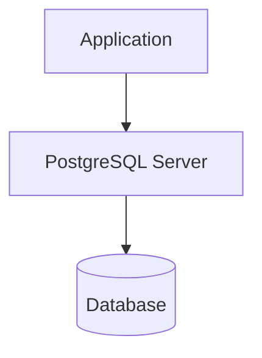

# What is PostgreSQL?

## Definition

**PostgreSQL** (pronounced **Post-gres-Q-L**) is a powerful, open-source **Object-Relational Database Management System (ORDBMS)** that uses SQL as its primary query language.

It is designed to store, manage, and process data efficiently while supporting advanced features such as transactions, indexing, JSON, stored procedures, window functions, and more.

PostgreSQL is widely used in web applications, enterprise software, financial systems, data analytics, and cloud platforms.

---

# Quick Facts

| Feature | Value |
|----------|-------|
| Full Name | PostgreSQL |
| Initial Release | 1996 |
| Type | Object-Relational Database Management System (ORDBMS) |
| License | PostgreSQL License (Open Source) |
| Primary Language | SQL |
| Operating Systems | Windows, Linux, macOS |
| Official Website | https://www.postgresql.org |

---

# What Does "Object-Relational" Mean?

A traditional Relational Database Management System (RDBMS) stores data in related tables.

PostgreSQL extends this model by supporting advanced data types and extensibility features, making it an **Object-Relational Database Management System (ORDBMS)**.

Examples of advanced PostgreSQL features include:

- JSON & JSONB
- Arrays
- User-defined data types
- Functions
- Stored Procedures
- Composite Types
- Extensions

For most day-to-day SQL work, PostgreSQL behaves like a relational database while offering additional capabilities when needed.

---

# History of PostgreSQL

PostgreSQL originated from the **POSTGRES** project at the University of California, Berkeley.

Timeline:

| Year | Event |
|------|-------|
| 1986 | POSTGRES project begins |
| 1994 | SQL support added |
| 1996 | Renamed to PostgreSQL |
| Today | One of the world's most popular open-source databases |

---

# Why PostgreSQL?

PostgreSQL is trusted by organizations ranging from startups to large enterprises because it is:

- Free and open source
- Reliable
- Secure
- Standards-compliant
- Highly extensible
- Suitable for both small and large applications

---

# Key Features

## Open Source

Anyone can download, use, modify, and distribute PostgreSQL without licensing fees.

---

## ACID Compliance

PostgreSQL fully supports ACID transactions.

This ensures:

- Reliable transactions
- Data consistency
- Crash recovery
- Safe concurrent operations

---

## SQL Standards Compliance

PostgreSQL closely follows the SQL standard while providing useful extensions.

---

## Advanced Data Types

Supports more than traditional text and numbers.

Examples include:

- JSON
- JSONB
- Arrays
- UUID
- XML
- Network Address Types
- Geometric Types

Example:

```sql
CREATE TABLE users (

    id SERIAL PRIMARY KEY,

    profile JSONB

);
```

---

## Powerful Indexing

Supports multiple indexing methods.

Examples:

- B-tree
- Hash
- GIN
- GiST
- BRIN
- SP-GiST

Indexes significantly improve query performance on large datasets.

---

## Views

PostgreSQL supports:

- Views
- Materialized Views

These simplify complex queries and reporting.

---

## Stored Procedures and Functions

Business logic can be executed inside the database.

Example:

```sql
CREATE FUNCTION calculate_bonus()
RETURNS NUMERIC
AS $$
BEGIN

    RETURN 5000;

END;
$$ LANGUAGE plpgsql;
```

---

## Window Functions

PostgreSQL has excellent support for analytical queries.

Example:

```sql
SELECT

employee_name,

salary,

RANK() OVER(ORDER BY salary DESC)

FROM employees;
```

---

## Full Text Search

Applications can search large text efficiently without external search engines.

---

## Extensions

PostgreSQL can be extended using official and community extensions.

Popular examples:

- PostGIS
- pg_stat_statements
- pgcrypto
- uuid-ossp

---

# PostgreSQL Architecture (High-Level)



The application sends SQL queries to the PostgreSQL server.

The server processes the request and interacts with the database.

---

# PostgreSQL Components

## Server

Processes SQL queries and manages databases.

---

## Database

Contains schemas, tables, indexes, views, and other objects.

---

## Schema

Organizes database objects into logical groups.

---

## Table

Stores related records.

---

## Rows

Individual records.

---

## Columns

Attributes describing each record.

---

## Client

Software used to communicate with PostgreSQL.

Examples:

- pgAdmin
- psql
- DBeaver
- Python
- Power BI

---

# Where PostgreSQL is Used

## Banking

- Customer Accounts
- Transactions
- Loan Systems

---

## E-Commerce

- Products
- Orders
- Inventory
- Payments

---

## Healthcare

- Patient Records
- Prescriptions
- Appointments

---

## Education

- Students
- Courses
- Examinations

---

## Data Analytics

- Dashboards
- Reporting
- ETL Pipelines

---

## GIS Applications

Using the PostGIS extension for geographic data.

---

# PostgreSQL vs MySQL

| Feature | PostgreSQL | MySQL |
|----------|------------|--------|
| Open Source | ✅ | ✅ |
| ACID Compliance | Excellent | Good |
| JSON Support | Advanced | Good |
| Window Functions | Excellent | Supported |
| Extensions | Extensive | Limited |
| Advanced SQL | Excellent | Good |
| Performance | Excellent for complex workloads | Excellent for many web workloads |

Both are excellent databases. PostgreSQL is often preferred for applications requiring advanced SQL features and complex analytical workloads.

---

# Advantages

- Completely free
- Reliable
- Secure
- Highly scalable
- Excellent SQL support
- Rich feature set
- Strong community
- Cross-platform
- Extensible
- Excellent documentation

---

# Limitations

No technology is perfect.

Compared to some simpler databases:

- Initial learning curve may be steeper.
- Advanced configuration can require experience.
- Some enterprise administration tasks may require deeper expertise.

These are generally outweighed by its flexibility and capabilities.

---

# Common PostgreSQL Terminology

| Term | Meaning |
|------|----------|
| Cluster | A PostgreSQL server instance managing one or more databases |
| Database | Collection of related objects |
| Schema | Logical namespace inside a database |
| Table | Stores records |
| Row | Single record |
| Column | Attribute of a record |
| Query | SQL statement |
| Transaction | Group of SQL operations treated as one unit |

---

# Best Practices

- Use meaningful database names.
- Choose appropriate data types.
- Define Primary Keys.
- Use Foreign Keys where appropriate.
- Create indexes only when beneficial.
- Back up databases regularly.
- Follow SQL naming conventions.

---

# Common Mistakes

❌ Using `TEXT` for every column without considering more appropriate data types.

❌ Ignoring indexes on frequently searched columns.

❌ Storing duplicate information.

❌ Not using transactions for related updates.

---

# Interview Questions

## What is PostgreSQL?

PostgreSQL is an open-source Object-Relational Database Management System (ORDBMS) that supports SQL and many advanced database features.

---

## Is PostgreSQL free?

Yes. PostgreSQL is free and open source under the PostgreSQL License.

---

## Why is PostgreSQL called an ORDBMS?

Because it combines traditional relational database features with object-oriented capabilities such as user-defined types, inheritance, and extensibility.

---

## Name some advanced PostgreSQL features.

- JSONB
- Window Functions
- Materialized Views
- Extensions
- Full Text Search
- Stored Procedures
- Arrays

---

## Key Takeaways

- PostgreSQL is an open-source ORDBMS.
- It fully supports SQL and ACID transactions.
- It offers many advanced features beyond a traditional RDBMS.
- It is suitable for applications ranging from small projects to enterprise systems.
- PostgreSQL is the database used throughout this documentation.

---

# Practice Questions

## Beginner

1. What is PostgreSQL?
2. What does ORDBMS stand for?
3. Name five features of PostgreSQL.

---

## Intermediate

1. Explain the difference between an RDBMS and an ORDBMS.
2. Why is PostgreSQL popular for analytical workloads?

---

## Advanced

A company is choosing between PostgreSQL and a simpler relational database for an analytics platform. Discuss the PostgreSQL features that could influence this decision, such as SQL support, extensibility, data types, and analytical capabilities.
