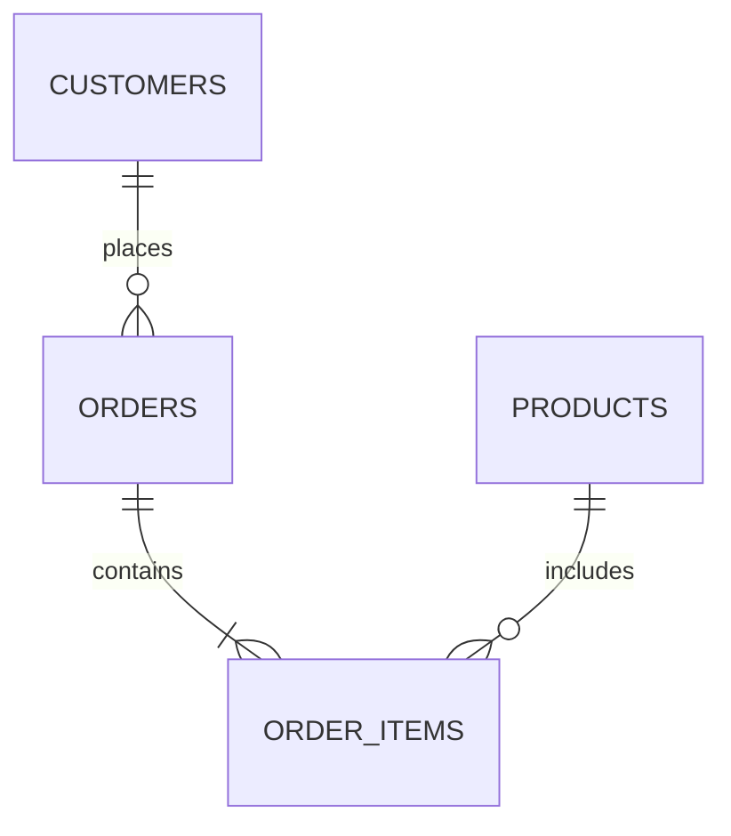

# What is an RDBMS (Relational Database Management System)?

## Definition

A **Relational Database Management System (RDBMS)** is a type of Database Management System (DBMS) that stores data in **tables** and organizes those tables using **relationships**.

Unlike a traditional DBMS, an RDBMS allows multiple tables to be connected using **Primary Keys** and **Foreign Keys**, making data more organized, consistent, and easier to manage.

**Examples of RDBMS:**

- PostgreSQL
- MySQL
- Oracle Database
- Microsoft SQL Server
- SQLite
- MariaDB

---

# Why Do We Need an RDBMS?

Imagine an online shopping application.

The application needs to store:

- Customers
- Products
- Orders
- Payments
- Employees

Instead of storing everything in one huge table, an RDBMS stores each type of information in separate tables and links them together.

This approach:

- Reduces duplicate data
- Improves performance
- Makes updates easier
- Maintains data integrity

---

# How an RDBMS Organizes Data



The diagram shows:

- A customer can place many orders.
- An order can contain many products.
- Products can appear in many orders.

---

# Tables in an RDBMS

## Customers

| Customer ID | Name | City |
|--------------|------|------|
| 101 | Alice | Delhi |
| 102 | Bob | Mumbai |

---

## Orders

| Order ID | Customer ID | Total |
|-----------|-------------|--------|
| 5001 | 101 | 2500 |
| 5002 | 102 | 1800 |

Notice that the Orders table does **not** store the customer's name.

Instead, it stores:

```
Customer ID
```

which links back to the Customers table.

This eliminates duplicate data.

---

# Components of an RDBMS

An RDBMS consists of several components.

## Database

A collection of related tables.

---

## Tables

Data is stored in rows and columns.

Example:

| Employee ID | Name | Salary |
|--------------|------|---------|
|101|John|50000|

---

## Rows (Records)

Each row represents one record.

Example:

```
101 | John | 50000
```

One employee = One row.

---

## Columns (Fields)

Columns describe the attributes of the data.

Example:

```
Employee ID
Name
Salary
Department
```

---

# Primary Key

A **Primary Key** uniquely identifies every row in a table.

Example:

```sql
CREATE TABLE employees (

    employee_id INT PRIMARY KEY,

    employee_name VARCHAR(100),

    salary NUMERIC

);
```

Rules:

- Cannot contain NULL values.
- Must be unique.
- One primary key per table.

Example:

| Employee ID | Name |
|--------------|------|
|101|John|
|102|David|

Employee ID uniquely identifies each employee.

---

# Foreign Key

A **Foreign Key** creates a relationship between two tables.

Example:

```sql
CREATE TABLE orders (

    order_id INT PRIMARY KEY,

    customer_id INT,

    FOREIGN KEY (customer_id)

    REFERENCES customers(customer_id)

);
```

Now every order belongs to an existing customer.

---

# Relationships

## One-to-One (1:1)

Example:

```
Employee

↓

Passport
```

One employee has one passport.

---

## One-to-Many (1:N)

Example:

```
Department

↓

Employees
```

One department contains many employees.

---

## Many-to-Many (M:N)

Example:

```
Students

↓

Courses
```

One student can enroll in many courses.

One course can have many students.

This is implemented using a junction table.

---

# Why Relationships Matter

Without relationships:

```
Customer Name

Customer Address

Customer Phone
```

would be repeated in every order.

With relationships:

Only the Customer ID is stored.

Benefits:

- Less storage
- Faster updates
- Better consistency

---

# ACID Properties

One of the biggest strengths of an RDBMS is transaction reliability.

Every transaction follows the **ACID** properties.

## Atomicity

A transaction is completed entirely or not at all.

Example:

Money transfer.

Either:

- Debit succeeds
- Credit succeeds

or

Neither happens.

---

## Consistency

The database always remains in a valid state.

Rules and constraints are never violated.

---

## Isolation

Multiple users can work simultaneously without interfering with one another.

---

## Durability

Once data is committed, it remains saved even after a power failure or system crash.

---

# Normalization (Overview)

Normalization is the process of organizing data to reduce duplication and improve consistency.

Benefits:

- Eliminates duplicate data
- Saves storage
- Improves integrity
- Simplifies maintenance

We'll study normalization in detail later.

---

# DBMS vs RDBMS

| Feature | DBMS | RDBMS |
|----------|------|--------|
| Stores data | ✅ | ✅ |
| Tables | May or may not | ✅ |
| Relationships | ❌ | ✅ |
| Primary Keys | Optional | Required for good design |
| Foreign Keys | ❌ | ✅ |
| Normalization | Limited | Supported |
| ACID Transactions | Limited | Fully Supported |

---

# Why PostgreSQL is an RDBMS

PostgreSQL stores data in related tables.

It supports:

- Primary Keys
- Foreign Keys
- Constraints
- Transactions
- ACID Compliance
- Views
- Indexes
- Stored Procedures
- Triggers
- Window Functions
- Advanced SQL Features

These capabilities make PostgreSQL one of the most powerful open-source RDBMS available.

---

# Industry Examples

## Banking

Customers

↓

Accounts

↓

Transactions

---

## E-commerce

Customers

↓

Orders

↓

Order Items

↓

Products

---

## Hospital

Patients

↓

Appointments

↓

Doctors

---

## University

Students

↓

Enrollments

↓

Courses

---

# Best Practices

✅ Use Primary Keys for every table.

✅ Create relationships using Foreign Keys.

✅ Normalize data whenever possible.

✅ Avoid storing duplicate information.

✅ Use meaningful table and column names.

---

# Common Mistakes

❌ Storing everything in one table.

❌ Repeating customer information in every order.

❌ Not defining Primary Keys.

❌ Ignoring Foreign Keys.

---

# Interview Questions

## What is an RDBMS?

An RDBMS is a Database Management System that stores data in related tables using keys and relationships.

---

## Difference between DBMS and RDBMS?

A DBMS stores data.

An RDBMS stores data in related tables and enforces relationships, integrity, and transactions.

---

## What is a Primary Key?

A column that uniquely identifies each record in a table.

---

## What is a Foreign Key?

A column that references the Primary Key of another table, creating a relationship.

---

## What are ACID properties?

- Atomicity
- Consistency
- Isolation
- Durability

---

# Key Takeaways

- An RDBMS stores data in tables.
- Tables are connected using relationships.
- Primary Keys uniquely identify records.
- Foreign Keys connect tables.
- PostgreSQL is an ACID-compliant RDBMS.
- Relationships reduce redundancy and improve data integrity.

---

# Practice Questions

## Beginner

1. What is an RDBMS?
2. Name five examples of RDBMS software.
3. What is a Primary Key?

---

## Intermediate

1. Explain the difference between a Primary Key and a Foreign Key.
2. Why are relationships important in relational databases?

---

## Advanced

Design a simple relational database for a library management system. Identify the tables, Primary Keys, Foreign Keys, and relationships between them.
