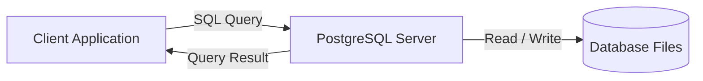
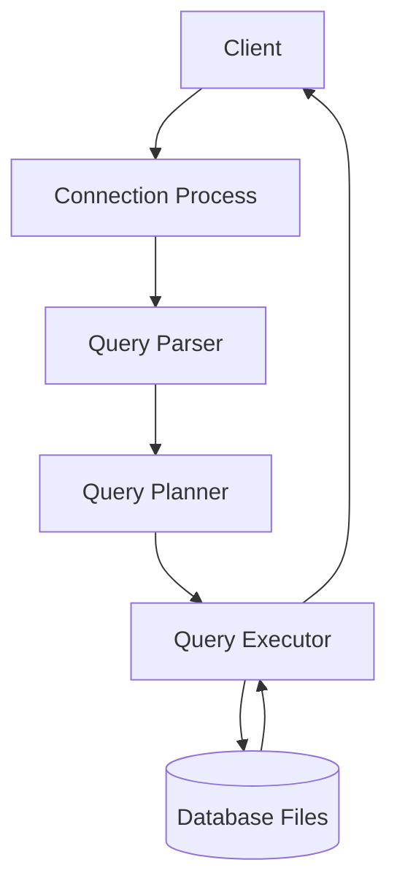
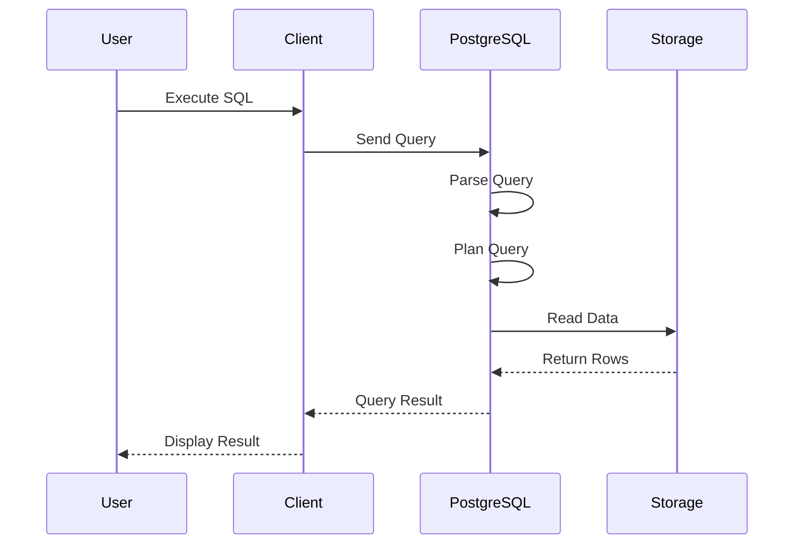

# PostgreSQL Architecture

## Overview

Understanding PostgreSQL architecture helps you understand what happens behind the scenes when you execute an SQL query.

For example, when you run:

```sql
SELECT * FROM employees;
```

The query doesn't directly access the data file. Instead, PostgreSQL processes the request through several internal components before returning the result.

Understanding this architecture will help you:

- Understand how PostgreSQL works internally.
- Write better SQL queries.
- Improve query performance.
- Troubleshoot database issues.
- Prepare for PostgreSQL interviews.

---

# Learning Objectives

After completing this chapter, you will be able to:

- Explain PostgreSQL architecture.
- Identify the major PostgreSQL components.
- Understand how a query is processed.
- Differentiate between the client and the server.
- Describe the lifecycle of an SQL query.

---

# What is PostgreSQL Architecture?

PostgreSQL architecture describes **how different components of PostgreSQL work together** to process SQL queries, manage data, and communicate with client applications.

At a high level, PostgreSQL follows a **Client–Server Architecture**.



---

# Client-Server Architecture

The architecture consists of two main parts.

## Client

The client is any application that sends SQL queries to PostgreSQL.

Examples:

- pgAdmin
- psql
- Python
- Java
- Power BI
- Excel
- DBeaver

The client does **not** store data.

Its responsibility is to:

- Connect to PostgreSQL.
- Send SQL statements.
- Receive query results.

---

## Server

The PostgreSQL Server is responsible for:

- Accepting client connections.
- Authenticating users.
- Processing SQL queries.
- Managing transactions.
- Reading and writing data.
- Returning query results.

The server performs all database operations.

---

# PostgreSQL Architecture



---

# Components of PostgreSQL Architecture

## 1. Client

A client is any software that communicates with PostgreSQL.

Example:

```text
pgAdmin

psql

Power BI

Python Application
```

---

## 2. Connection Process

When a client attempts to connect:

- Username is verified.
- Password is verified.
- Database permissions are checked.
- A session is created.

Only authenticated users can access the database.

---

## 3. Query Parser

The parser checks whether the SQL statement is valid.

Example:

```sql
SELECT employee_name
FROM employees;
```

The parser verifies:

- SQL syntax
- Table names
- Column names
- Keywords

If the query is invalid:

```text
ERROR:
syntax error at or near ...
```

is returned.

---

## 4. Query Planner (Optimizer)

Once the query is valid, PostgreSQL determines the most efficient way to execute it.

The planner considers:

- Available indexes
- Table size
- Join strategy
- Query cost
- Statistics

Its goal is to minimize execution time.

---

## 5. Query Executor

The executor performs the execution plan.

It may:

- Read rows.
- Update rows.
- Delete rows.
- Insert rows.
- Sort data.
- Join tables.

The results are then returned to the client.

---

## 6. Database Storage

Data is stored on disk.

Storage includes:

- Tables
- Indexes
- WAL (Write-Ahead Log)
- Configuration files
- System catalogs

PostgreSQL manages these files automatically.

---

# Query Execution Flow

Suppose you execute:

```sql
SELECT employee_name
FROM employees
WHERE salary > 60000;
```

The execution flow is:



---

# Background Processes

Besides handling client queries, PostgreSQL runs several background processes.

Some important ones include:

| Process | Purpose |
|----------|----------|
| Checkpointer | Writes modified data to disk. |
| Background Writer | Writes dirty pages to storage. |
| WAL Writer | Writes transaction logs. |
| Autovacuum | Cleans obsolete row versions and updates statistics. |
| Logger | Records server activity and errors. |

These processes improve reliability and performance.

---

# Write-Ahead Logging (WAL)

PostgreSQL uses **Write-Ahead Logging (WAL)** to protect data.

Before changing actual data files:

1. The change is written to the WAL.
2. The WAL is safely stored.
3. The data files are updated.

This enables crash recovery and ensures transaction durability.

---

# Why This Architecture Matters

Benefits include:

- Reliable transactions
- High performance
- Multi-user access
- Scalability
- Crash recovery
- Efficient query execution

---

# Real-World Example

Imagine an HR application requests:

```sql
SELECT *
FROM employees;
```

The process is:

1. The HR application sends the query.
2. PostgreSQL authenticates the user.
3. The parser validates the SQL.
4. The planner chooses the best execution strategy.
5. The executor reads the employee data.
6. The results are returned to the HR application.

This entire process usually completes in milliseconds.

---

# Best Practices

- Create indexes for frequently searched columns.
- Use parameterized queries in applications.
- Keep PostgreSQL updated.
- Monitor long-running queries.
- Analyze execution plans for complex queries.

---

# Common Mistakes

❌ Assuming the client stores the database.

❌ Believing SQL queries directly access data files.

❌ Ignoring query optimization.

❌ Confusing the PostgreSQL server with pgAdmin.

---

# Interview Questions

### What architecture does PostgreSQL use?

PostgreSQL uses a **Client–Server Architecture**.

---

### What is the role of the Query Planner?

The Query Planner determines the most efficient execution plan for an SQL query.

---

### What is WAL?

Write-Ahead Logging (WAL) is PostgreSQL's mechanism for ensuring data durability and enabling crash recovery.

---

### Does pgAdmin store the database?

No.

pgAdmin is only a graphical client.

The PostgreSQL server stores and manages the database.

---

# Key Takeaways

- PostgreSQL follows a Client–Server Architecture.
- Clients send SQL queries.
- The PostgreSQL server processes those queries.
- The Query Parser validates SQL.
- The Query Planner optimizes execution.
- The Query Executor retrieves or modifies data.
- WAL ensures data durability and crash recovery.

---

# Practice Exercises

## 🟢 Beginner

1. What are the two main parts of PostgreSQL architecture?
2. Name three PostgreSQL clients.
3. What is the role of the PostgreSQL server?

## 🟡 Intermediate

1. Explain the lifecycle of an SQL query.
2. What is the difference between the Query Parser and the Query Planner?

## 🔴 Advanced

A Power BI dashboard sends a query to PostgreSQL to retrieve sales data. Explain each architectural component involved, from the moment the query is sent until the dashboard displays the results.

---

# Summary

In this chapter, you learned:

- PostgreSQL uses a Client–Server Architecture.
- Clients communicate with the PostgreSQL server using SQL.
- Queries are parsed, optimized, and executed before data is returned.
- Background processes such as the Checkpointer, WAL Writer, and Autovacuum contribute to reliability and performance.

This architecture provides the foundation for PostgreSQL's scalability, reliability, and efficient query processing.

---

# Next Topic

➡️ **07_Installation.md**

In the next chapter, you'll install PostgreSQL on Windows, understand every installation option, and prepare your development environment for writing SQL.
