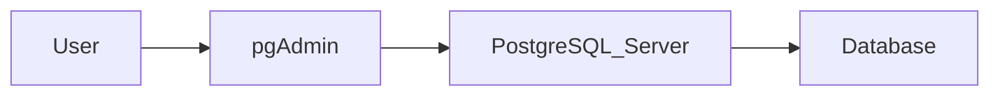

# pgAdmin

## Overview

**pgAdmin** is the official graphical administration and development tool for PostgreSQL. It provides a user-friendly interface for creating databases, writing SQL queries, managing users, monitoring performance, and administering PostgreSQL servers.

Instead of typing every command in a terminal, pgAdmin allows you to perform most database operations through an intuitive graphical interface.

This makes it an excellent tool for beginners, database administrators, developers, and data analysts.

---

# Learning Objectives

After completing this chapter, you will be able to:

- Explain what pgAdmin is.
- Understand its main components.
- Connect to a PostgreSQL server.
- Navigate the pgAdmin interface.
- Open the Query Tool.
- Execute SQL queries.
- Understand when to use pgAdmin versus psql.

---

# What is pgAdmin?

pgAdmin is the official GUI (Graphical User Interface) client for PostgreSQL.

It allows you to:

- Connect to PostgreSQL servers
- Create databases
- Create tables
- Write SQL queries
- Manage users and roles
- Create backups
- Restore databases
- View execution plans
- Monitor database activity

---

# Why Use pgAdmin?

Without pgAdmin, you would perform every operation using command-line tools.

With pgAdmin, many administrative tasks become easier because you can use graphical menus while still having full access to SQL through the Query Tool.

For learning and day-to-day database management, pgAdmin provides an excellent balance between ease of use and functionality.

---

# pgAdmin Architecture



pgAdmin does **not** store your data.

It acts as a client that communicates with the PostgreSQL server.

---

# Launching pgAdmin

Open the Windows Start Menu.

Search for:

```text
pgAdmin 4
```

Launch the application.

During the first launch, pgAdmin asks you to create a **Master Password**.

---

# Master Password

The Master Password encrypts the saved server passwords inside pgAdmin.

It is **not** your PostgreSQL password.

| Password | Purpose |
|----------|----------|
| PostgreSQL Password | Connects to the PostgreSQL server |
| pgAdmin Master Password | Protects saved connection information |

You can use different passwords for each.

---

# Connecting to PostgreSQL

Expand:

```
Servers
```

If prompted, enter the PostgreSQL password you created during installation.

After a successful connection, you'll see a structure similar to:

```text
Servers
└── PostgreSQL 17
    ├── Databases
    ├── Login/Group Roles
    ├── Tablespaces
```

---

# pgAdmin Interface

The pgAdmin window consists of several sections.

## Object Explorer

Located on the left side.

Displays:

- Servers
- Databases
- Schemas
- Tables
- Views
- Functions
- Indexes

---

## Dashboard

Displays information about the selected database, including:

- Active sessions
- Transactions
- Database size
- Server activity

---

## Query Tool

The Query Tool is where SQL statements are written and executed.

Open it by:

```
Tools
→ Query Tool
```

Shortcut:

```
Alt + Shift + Q
```

---

## Messages Panel

Displays:

- Success messages
- Errors
- Warnings
- Execution time

---

## Data Output

Displays the results returned by SQL queries.

Example:

```sql
SELECT version();
```

Output:

| version |
|----------|
| PostgreSQL 17.x |

---

# Running Your First Query

Open the Query Tool.

Execute:

```sql
SELECT version();
```

If PostgreSQL returns the version information, your installation is working correctly.

---

# Another Example

```sql
SELECT CURRENT_DATE;
```

Example output:

| current_date |
|--------------|
| 2026-07-30 |

---

# Common Tasks in pgAdmin

You can use pgAdmin to:

- Create databases
- Create schemas
- Create tables
- Modify tables
- Execute SQL
- Import data
- Export data
- Create users
- Create backups
- Restore databases
- Monitor activity

---

# Advantages of pgAdmin

- Beginner-friendly interface
- Official PostgreSQL tool
- Powerful Query Tool
- Database administration features
- Performance monitoring
- Backup and restore support
- Cross-platform

---

# Limitations

- Uses more system resources than psql.
- Slower for repetitive administrative tasks.
- Not ideal for automation.

For scripting and automation, the command-line interface is often a better choice.

---

# pgAdmin vs psql

| Feature | pgAdmin | psql |
|----------|----------|------|
| Graphical Interface | ✅ | ❌ |
| Command Line | ❌ | ✅ |
| Beginner Friendly | ✅ | Moderate |
| Automation | Limited | Excellent |
| Performance | Good | Excellent |
| Learning SQL | Excellent | Excellent |

Both tools are valuable and complement each other.

---

# Best Practices

- Use pgAdmin while learning PostgreSQL.
- Organize databases using schemas.
- Use the Query Tool instead of relying only on graphical menus.
- Review SQL generated by graphical operations to understand what happens behind the scenes.
- Back up important databases regularly.

---

# Common Mistakes

❌ Confusing pgAdmin with PostgreSQL Server.

❌ Forgetting the PostgreSQL password.

❌ Executing queries against the wrong database.

❌ Relying only on GUI operations without learning SQL.

---

# Interview Questions

### What is pgAdmin?

pgAdmin is the official graphical administration and development tool for PostgreSQL.

---

### Does pgAdmin store databases?

No.

The PostgreSQL server stores the databases.

pgAdmin is only a client application.

---

### Can you execute SQL queries in pgAdmin?

Yes.

The Query Tool allows users to execute SQL statements directly.

---

### Is pgAdmin required to use PostgreSQL?

No.

PostgreSQL can also be used through tools such as `psql`, programming languages, or third-party clients.

---

# Key Takeaways

- pgAdmin is the official GUI for PostgreSQL.
- It communicates with the PostgreSQL server but does not store data.
- The Query Tool is used to write and execute SQL.
- pgAdmin is well suited for administration, learning, and development.
- Understanding SQL remains essential, even when using graphical tools.

---

# Practice Exercises

## 🟢 Beginner

1. Open pgAdmin.
2. Connect to your PostgreSQL server.
3. Locate the Databases node.
4. Open the Query Tool.
5. Execute `SELECT version();`.

---

## 🟡 Intermediate

1. Execute `SELECT CURRENT_DATE;`.
2. Explore the Object Explorer and identify databases, schemas, and tables.

---

## 🔴 Advanced

Research two alternative PostgreSQL clients (such as DBeaver or DataGrip) and compare them with pgAdmin in terms of usability, features, and target audience.

---

# Summary

In this chapter, you learned what pgAdmin is, how it connects to PostgreSQL, how to navigate its interface, and how to execute your first SQL queries. You also learned the distinction between pgAdmin and the PostgreSQL server.

---

# Related Topics

**Previous**

- `07_Installing_PostgreSQL.md`

**Next**

- `09_psql.md`

**Related**

- `10_First_Database.md`
