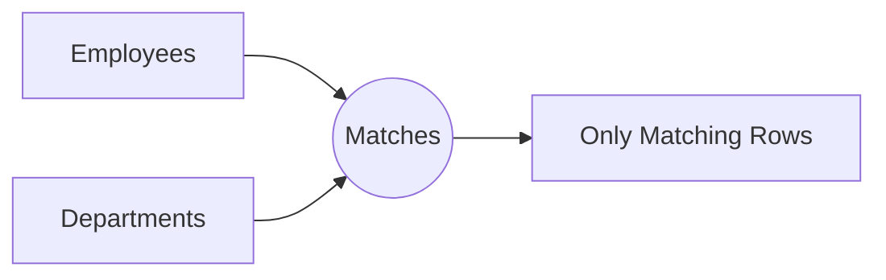
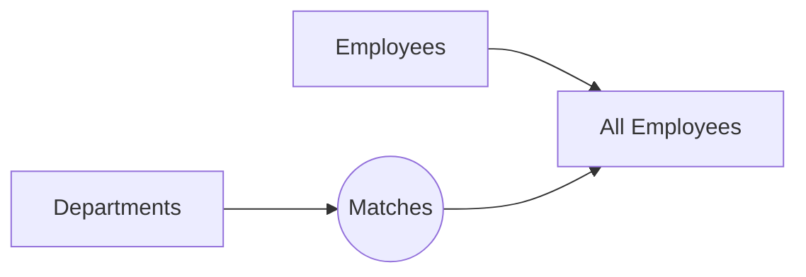
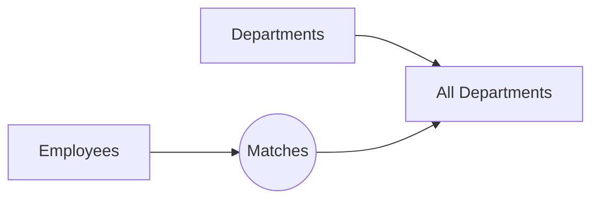
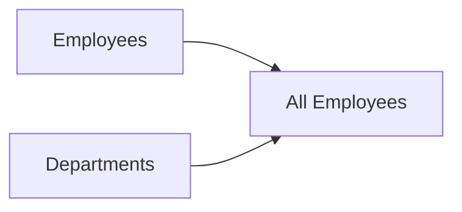

# SQL Join Comparison

## Overview

SQL provides multiple join types, each designed for a different purpose.

Choosing the correct join is essential for writing accurate queries, optimizing performance, and avoiding unexpected results.

This chapter compares the four major joins side by side.

---

# Learning Objectives

After completing this chapter, you will be able to:

- Identify the differences between joins.
- Choose the correct join for a business problem.
- Predict query results.
- Answer interview questions confidently.

---

# Sample Tables

## Employees

| employee_id | first_name | department_id |
|-------------|------------|---------------|
|1|Rahul|1|
|2|Priya|2|
|3|Amit|1|
|4|Neha|NULL|
|5|Rohan|4|

---

## Departments

| department_id | department_name |
|---------------|-----------------|
|1|IT|
|2|HR|
|3|Finance|

---

# Visual Comparison

## INNER JOIN

```text
Employees      Departments

Rahul -------- IT

Priya -------- HR

Amit --------- IT
```

Only matching rows.

---

## LEFT JOIN

```text
Rahul -------- IT

Priya -------- HR

Amit --------- IT

Neha -------- NULL

Rohan -------- NULL
```

All employees appear.

---

## RIGHT JOIN

```text
Rahul -------- IT

Priya -------- HR

Amit --------- IT

NULL --------- Finance
```

All departments appear.

---

## FULL OUTER JOIN

```text
Rahul -------- IT

Priya -------- HR

Amit --------- IT

Neha -------- NULL

Rohan -------- NULL

NULL -------- Finance
```

Everything appears.

---

# Mermaid Diagrams

## INNER JOIN



---

## LEFT JOIN



---

## RIGHT JOIN



---

## FULL OUTER JOIN



---

# Feature Comparison

| Feature | INNER | LEFT | RIGHT | FULL OUTER |
|----------|:-----:|:----:|:-----:|:----------:|
|Returns matching rows|✅|✅|✅|✅|
|Returns unmatched left rows|❌|✅|❌|✅|
|Returns unmatched right rows|❌|❌|✅|✅|
|Uses NULL for missing values|❌|✅|✅|✅|
|Common in reporting|✅|✅|⚠️|⚠️|
|Common in ETL|⚠️|✅|⚠️|✅|

---

# Result Comparison

| Employee | Department | INNER | LEFT | RIGHT | FULL |
|----------|------------|:-----:|:----:|:-----:|:----:|
|Rahul|IT|✅|✅|✅|✅|
|Priya|HR|✅|✅|✅|✅|
|Amit|IT|✅|✅|✅|✅|
|Neha|NULL|❌|✅|❌|✅|
|Rohan|NULL|❌|✅|❌|✅|
|NULL|Finance|❌|❌|✅|✅|

---

# Decision Tree

```text
Need only matching rows?

│

├── YES
│      │
│      ▼
│   INNER JOIN
│
└── NO
       │
       ▼

Need all rows from left table?

│

├── YES
│      │
│      ▼
│   LEFT JOIN
│
└── NO
       │
       ▼

Need all rows from right table?

│

├── YES
│      │
│      ▼
│   RIGHT JOIN
│
└── NO
       │
       ▼

Need every row from both tables?

│

▼

FULL OUTER JOIN
```

---

# When to Use Each Join

## INNER JOIN

Use when:

- Both records must exist.
- Generating reports.
- Customer orders.
- Employee departments.

---

## LEFT JOIN

Use when:

- Master records must always appear.
- Finding missing data.
- Showing customers without orders.
- Showing departments with zero employees.

---

## RIGHT JOIN

Use when:

- The right table is the primary dataset.
- Reading legacy SQL.
- A RIGHT JOIN is more natural for the data model.

Many teams still prefer rewriting it as a LEFT JOIN.

---

## FULL OUTER JOIN

Use when:

- Reconciling two datasets.
- Data migration.
- ETL validation.
- Comparing systems.
- Auditing.

---

# Performance Comparison

| Join | Performance |
|-------|-------------|
|INNER JOIN|⭐⭐⭐⭐⭐|
|LEFT JOIN|⭐⭐⭐⭐|
|RIGHT JOIN|⭐⭐⭐⭐|
|FULL OUTER JOIN|⭐⭐⭐|

Performance depends on indexing, statistics, and data size. The optimizer may choose different execution plans.

---

# Common Mistakes

## Choosing the Wrong Join

Need all customers?

Don't use:

```sql
INNER JOIN
```

Use:

```sql
LEFT JOIN
```

---

## Forgetting NULL Values

LEFT, RIGHT, and FULL OUTER JOIN can produce NULL values.

Always consider how your application should handle them.

---

## Filtering After a LEFT JOIN

```sql
WHERE right_table.column = 'Value'
```

This removes rows with NULL values from the right table and may produce results similar to an INNER JOIN.

If your goal is to preserve all rows from the left table, consider placing the condition in the `ON` clause instead.

---

# Interview Questions

### Which join returns only matching rows?

INNER JOIN.

---

### Which join returns every row from the left table?

LEFT JOIN.

---

### Which join returns every row from both tables?

FULL OUTER JOIN.

---

### Which join is used most often?

INNER JOIN and LEFT JOIN.

---

### Can RIGHT JOIN be rewritten?

Yes.

Swap the table order and use LEFT JOIN.

---

# Real-World Examples

| Business Problem | Recommended Join |
|------------------|------------------|
|Customers with orders|INNER JOIN|
|All customers|LEFT JOIN|
|Departments without employees|LEFT JOIN|
|Compare old vs new systems|FULL OUTER JOIN|
|Find orphan records|LEFT JOIN + `IS NULL`|
|Validate data migration|FULL OUTER JOIN|

---

# Quick Reference

| Goal | Join |
|------|------|
|Matching records only|INNER JOIN|
|Keep all left records|LEFT JOIN|
|Keep all right records|RIGHT JOIN|
|Keep everything|FULL OUTER JOIN|

---

# Cheat Sheet

```text
INNER JOIN

Match Only

----------------------------

LEFT JOIN

Everything Left
+
Matches

----------------------------

RIGHT JOIN

Everything Right
+
Matches

----------------------------

FULL OUTER JOIN

Everything
```

---

# Practice Exercises

## 🟢 Beginner

1. Which join returns only matching rows?
2. Which join returns all employees?
3. Which join returns all departments?

---

## 🟡 Intermediate

1. Which join would you use to find customers without orders?
2. Which join is best for data reconciliation?
3. Rewrite a RIGHT JOIN as a LEFT JOIN.

---

## 🔴 Advanced

For each scenario below, choose the correct join and explain why:

1. Generate a report of employees and departments, excluding employees without departments.
2. List every department, including departments with no employees.
3. Compare two customer databases after a migration.
4. Find products that have never been sold.
5. Show all customers and any orders they have placed.

---

# Summary

Understanding the differences between `INNER`, `LEFT`, `RIGHT`, and `FULL OUTER JOIN` is essential for writing accurate SQL queries. Choosing the correct join ensures that your reports, dashboards, and analytical queries return the intended results.

---

# Related Topics

**Previous**

- `05_FULL_OUTER_JOIN.md`

**Next**

- `07_CROSS_JOIN.md`

**Related**

- `02_INNER_JOIN.md`
- `03_LEFT_JOIN.md`
- `04_RIGHT_JOIN.md`
- `05_FULL_OUTER_JOIN.md`
