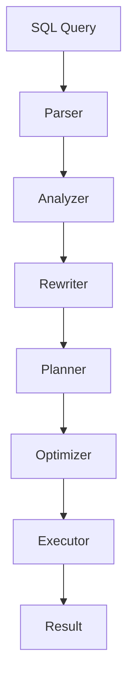

# Query Execution Pipeline

> Learn how PostgreSQL transforms a SQL query into an executable plan and returns the final result. Understanding the query execution pipeline is essential for writing high-performance SQL and diagnosing slow queries.

---

# Table of Contents

1. Introduction
2. Learning Objectives
3. Why the Query Execution Pipeline Matters
4. High-Level Architecture
5. Components of the Pipeline
6. End-to-End Query Flow
7. First Execution Example
8. Key Takeaways
9. Related Topics

---

# Introduction

When you execute a SQL statement, PostgreSQL does much more than simply read it from top to bottom.

Consider the following query:

```sql
SELECT
    employee_name,
    salary
FROM employees
WHERE salary > 50000;
```

Although this query appears simple, PostgreSQL performs multiple internal steps before returning the result.

It must determine:

- Is the SQL syntax valid?
- Do the referenced tables exist?
- Do the referenced columns exist?
- Does the user have permission to access the data?
- What is the fastest execution strategy?
- Should an index be used?
- Should the table be scanned sequentially?
- How should the final result be returned?

Every query follows a structured pipeline before execution.

---

# Learning Objectives

After completing this chapter, you will be able to:

- Explain every stage of PostgreSQL's query execution pipeline.
- Describe the responsibilities of the Parser, Analyzer, Rewriter, Planner, Optimizer, and Executor.
- Understand how PostgreSQL transforms SQL into an execution plan.
- Explain why understanding the pipeline is important for performance tuning.
- Build a strong foundation for learning `EXPLAIN` and query optimization.

---

# Why the Query Execution Pipeline Matters

Most SQL users know **what** query to write.

Professional database developers understand **how PostgreSQL executes it**.

This knowledge helps you:

- Write faster SQL.
- Read execution plans confidently.
- Design better indexes.
- Reduce unnecessary table scans.
- Diagnose slow queries.
- Explain optimization decisions during interviews.

Understanding the pipeline shifts your focus from simply writing SQL to understanding how the database engine works.

---

# PostgreSQL Query Execution Pipeline

Every SQL statement follows the same general lifecycle.

```text
            SQL Query
                │
                ▼
           ┌─────────┐
           │ Parser  │
           └─────────┘
                │
                ▼
          ┌──────────┐
          │ Analyzer │
          └──────────┘
                │
                ▼
          ┌──────────┐
          │ Rewriter │
          └──────────┘
                │
                ▼
          ┌──────────┐
          │ Planner  │
          └──────────┘
                │
                ▼
         ┌────────────┐
         │ Optimizer  │
         └────────────┘
                │
                ▼
         ┌────────────┐
         │ Executor   │
         └────────────┘
                │
                ▼
          Query Result
```

Each component has a specific responsibility.

---

# Mermaid Diagram

GitHub supports Mermaid diagrams natively.



---

# High-Level Architecture

The PostgreSQL execution engine is composed of several cooperating modules.

| Component | Responsibility |
|-----------|----------------|
| Parser | Validates SQL syntax and builds a parse tree |
| Analyzer | Resolves database objects and validates semantics |
| Rewriter | Applies rewrite rules and expands views |
| Planner | Generates multiple execution strategies |
| Optimizer | Chooses the lowest estimated cost plan |
| Executor | Executes the selected plan and returns rows |

Together, these components transform a SQL statement into an efficient execution plan.

---

# Pipeline Stages Overview

## 1. Parser

Purpose:

- Validate SQL syntax.
- Identify keywords.
- Check grammar.
- Build a parse tree.

Input:

```sql
SELECT *
FROM employees;
```

Output:

```
Parse Tree
```

The parser checks only the structure of the SQL statement. It does not verify whether the referenced tables or columns exist.

---

## 2. Analyzer

Purpose:

- Resolve table names.
- Resolve column names.
- Validate data types.
- Verify functions.
- Check permissions.

Input:

```
Parse Tree
```

Output:

```
Analyzed Query Tree
```

At this stage, PostgreSQL understands what database objects the query refers to.

---

## 3. Rewriter

Purpose:

- Expand views.
- Apply rewrite rules.
- Transform the query if necessary.

Input:

```
Analyzed Query
```

Output:

```
Rewritten Query
```

Most ordinary queries pass through this stage unchanged. However, queries involving views or rewrite rules may be transformed before planning.

---

## 4. Planner

Purpose:

Generate several possible execution strategies.

Example options:

- Sequential Scan
- Index Scan
- Bitmap Index Scan

The planner estimates the cost of each strategy using table statistics.

---

## 5. Optimizer

Purpose:

Choose the execution strategy with the lowest estimated cost.

Factors considered include:

- Number of rows
- Available indexes
- Join order
- Estimated I/O
- CPU cost

The optimizer does not execute the query—it selects the most efficient plan.

---

## 6. Executor

Purpose:

Run the selected execution plan.

Operations may include:

- Reading data pages
- Applying filters
- Performing joins
- Sorting rows
- Calculating aggregates
- Returning the final result

This is the only stage where PostgreSQL actually retrieves data.

---

# End-to-End Example

Query:

```sql
SELECT
    employee_name
FROM employees
WHERE department = 'IT';
```

Pipeline:

```text
SQL Query
      │
      ▼
Parser
      │
      ▼
Analyzer
      │
      ▼
Rewriter
      │
      ▼
Planner
      │
      ▼
Optimizer
      │
      ▼
Executor
      │
      ▼
Result
```

Each stage adds information or makes decisions before the next stage begins.

---

# Real-World Example

Imagine an e-commerce company with a table containing 50 million orders.

Query:

```sql
SELECT
    order_id,
    customer_id,
    total_amount
FROM orders
WHERE customer_id = 1050;
```

PostgreSQL does not immediately search the table.

Instead, it asks:

- Is the query valid?
- Does the table exist?
- Is there an index on `customer_id`?
- Would a Sequential Scan be faster?
- Would an Index Scan be faster?
- What is the estimated cost of each option?

Only after answering these questions does it begin reading data.

---

# Why This Matters

Without understanding the execution pipeline, developers often:

- Guess why queries are slow.
- Add indexes unnecessarily.
- Rewrite SQL without measuring performance.
- Misinterpret execution plans.

Understanding the pipeline provides a structured way to diagnose and optimize SQL performance.

---

# Key Takeaways

- Every SQL statement follows the same execution pipeline.
- PostgreSQL separates query validation, planning, optimization, and execution.
- The Executor is the only stage that reads data.
- The Planner generates possible strategies.
- The Optimizer chooses the lowest estimated cost plan.
- Understanding the pipeline is the foundation for learning `EXPLAIN` and performance tuning.

---

# Summary

The PostgreSQL query execution pipeline transforms a SQL statement into an executable plan through a series of well-defined stages. Each stage has a distinct responsibility, from validating syntax to selecting the most efficient execution strategy. Understanding this process is essential for writing efficient SQL, interpreting execution plans, and optimizing database performance.

---

# Next Chapter

The next part of this chapter explores the first three stages in depth:

- Parser
- Analyzer
- Rewriter

You'll learn how PostgreSQL validates SQL statements, resolves database objects, and rewrites queries before planning begins.

---

# Related Topics

- Query Processing Order
- EXPLAIN
- EXPLAIN ANALYZE
- Query Optimization
- PostgreSQL Architecture
- Planner
- Optimizer
