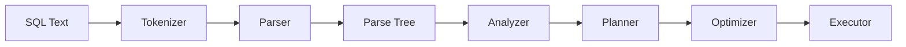

# Parser

> Learn how PostgreSQL transforms raw SQL text into a structured representation that the database engine can understand.

---

# Table of Contents

1. Introduction
2. Learning Objectives
3. Why PostgreSQL Needs a Parser
4. SQL Compilation Process
5. Lexical Analysis
6. SQL Tokens
7. Keywords
8. Identifiers
9. Literals
10. Operators
11. Comments
12. Syntax Analysis
13. Parse Tree
14. Parser Architecture
15. Common Errors
16. Business Example
17. Best Practices
18. Interview Questions
19. Practice Exercises
20. Summary

---

# Introduction

Whenever a SQL query is submitted to PostgreSQL, the database does not immediately begin reading tables or executing operations.

Instead, the first task is to determine whether the SQL statement is **syntactically valid**.

For example:

```sql
SELECT employee_name
FROM employees
WHERE salary > 50000;
```

Although this appears simple to us, PostgreSQL initially sees it as a stream of characters.

Before it can determine which table to read or which rows to return, it must convert those characters into a structured internal representation.

This responsibility belongs to the **Parser**.

The Parser is the first stage of PostgreSQL's query execution pipeline.

Its primary role is to:

- Read SQL text.
- Break it into meaningful components.
- Validate SQL grammar.
- Construct a Parse Tree.

Only after these steps are complete can PostgreSQL continue to semantic analysis and query planning.

---

# Learning Objectives

After completing this chapter, you will be able to:

- Explain the purpose of the PostgreSQL Parser.
- Describe the stages of SQL parsing.
- Differentiate lexical analysis from syntax analysis.
- Understand how Parse Trees are generated.
- Identify common syntax errors.
- Explain why parsing is essential before query execution.

---

# Why PostgreSQL Needs a Parser

Imagine PostgreSQL receives the following text:

```text
SELECT employee_name FROM employees WHERE salary > 50000;
```

To PostgreSQL, this is initially just a sequence of bytes.

The database cannot determine:

- Where the query begins or ends.
- Which words are SQL keywords.
- Which words are table names.
- Which words are column names.
- Which symbols are operators.

Without a Parser, PostgreSQL would have no structured understanding of the SQL statement.

The Parser converts raw SQL text into a format that the rest of the database engine can interpret.

---

# SQL Compilation Process

The Parser is only the first stage in a larger process.



Each stage builds upon the output of the previous stage.

The quality of every later decision depends on the Parser producing a correct Parse Tree.

---

# Real-World Analogy

Think of a compiler for a programming language.

When you write:

```python
print("Hello")
```

The compiler first checks whether the syntax is valid before generating machine instructions.

PostgreSQL behaves similarly.

Before it can execute SQL, it must first verify that the statement follows PostgreSQL's SQL grammar.

---

# Key Takeaways

- The Parser is the first stage of query processing.
- It validates SQL syntax.
- It converts SQL text into a Parse Tree.
- It does not verify whether tables or columns exist.
- Object validation occurs later in the Analyzer.
