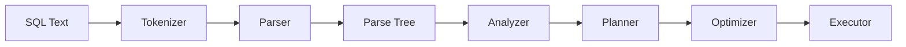
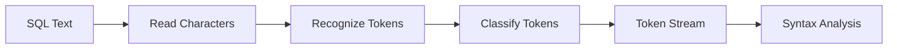
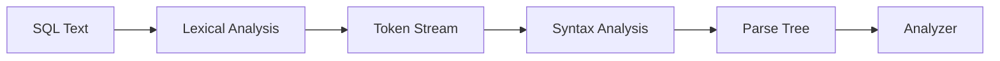
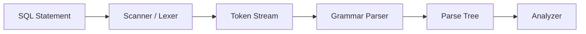
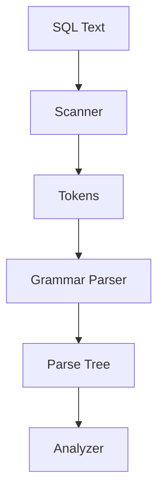
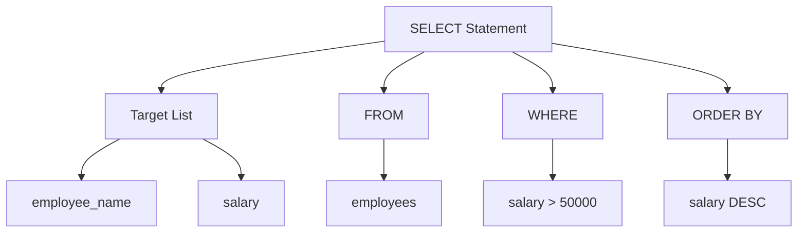
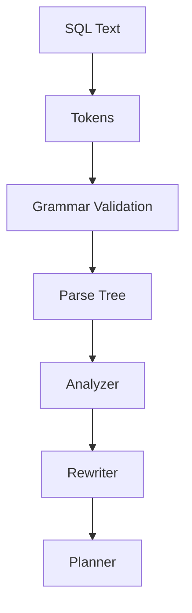
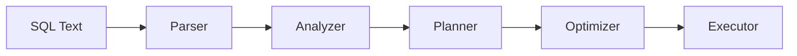
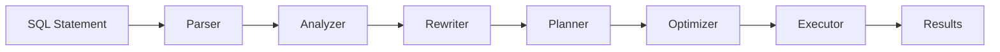

# Parser

> Learn how PostgreSQL transforms raw SQL text into a structured representation that the database engine can understand.

---

# Table of Contents

1. Introduction
2. Learning Objectives
3. Why PostgreSQL Needs a Parser
4. SQL Compilation Process
5. Lexical Analysis
6. SQL Tokens
7. Keywords
8. Identifiers
9. Literals
10. Operators
11. Comments
12. Syntax Analysis
13. Parse Tree
14. Parser Architecture
15. Common Errors
16. Business Example
17. Best Practices
18. Interview Questions
19. Practice Exercises
20. Summary

---

# Introduction

Whenever a SQL query is submitted to PostgreSQL, the database does not immediately begin reading tables or executing operations.

Instead, the first task is to determine whether the SQL statement is **syntactically valid**.

For example:

```sql
SELECT employee_name
FROM employees
WHERE salary > 50000;
```

Although this appears simple to us, PostgreSQL initially sees it as a stream of characters.

Before it can determine which table to read or which rows to return, it must convert those characters into a structured internal representation.

This responsibility belongs to the **Parser**.

The Parser is the first stage of PostgreSQL's query execution pipeline.

Its primary role is to:

- Read SQL text.
- Break it into meaningful components.
- Validate SQL grammar.
- Construct a Parse Tree.

Only after these steps are complete can PostgreSQL continue to semantic analysis and query planning.

---

# Learning Objectives

After completing this chapter, you will be able to:

- Explain the purpose of the PostgreSQL Parser.
- Describe the stages of SQL parsing.
- Differentiate lexical analysis from syntax analysis.
- Understand how Parse Trees are generated.
- Identify common syntax errors.
- Explain why parsing is essential before query execution.

---

# Why PostgreSQL Needs a Parser

Imagine PostgreSQL receives the following text:

```text
SELECT employee_name FROM employees WHERE salary > 50000;
```

To PostgreSQL, this is initially just a sequence of bytes.

The database cannot determine:

- Where the query begins or ends.
- Which words are SQL keywords.
- Which words are table names.
- Which words are column names.
- Which symbols are operators.

Without a Parser, PostgreSQL would have no structured understanding of the SQL statement.

The Parser converts raw SQL text into a format that the rest of the database engine can interpret.

---

# SQL Compilation Process

The Parser is only the first stage in a larger process.



Each stage builds upon the output of the previous stage.

The quality of every later decision depends on the Parser producing a correct Parse Tree.

---

# Real-World Analogy

Think of a compiler for a programming language.

When you write:

```python
print("Hello")
```

The compiler first checks whether the syntax is valid before generating machine instructions.

PostgreSQL behaves similarly.

Before it can execute SQL, it must first verify that the statement follows PostgreSQL's SQL grammar.

---

# Key Takeaways

- The Parser is the first stage of query processing.
- It validates SQL syntax.
- It converts SQL text into a Parse Tree.
- It does not verify whether tables or columns exist.
- Object validation occurs later in the Analyzer.


---

# Lexical Analysis (Tokenization)

## What is Lexical Analysis?

Lexical Analysis, also known as **Tokenization**, is the first operation performed by the PostgreSQL Parser.

Its job is to read the SQL statement character by character and divide it into meaningful pieces called **tokens**.

Instead of treating the query as one long string of text, PostgreSQL separates it into individual components that have specific meanings.

For example, consider the following SQL statement:

```sql
SELECT employee_name
FROM employees
WHERE salary > 50000;
```

To a human, this is already readable.

To PostgreSQL, however, it initially appears as:

```text
S E L E C T _ e m p l o y e e _ n a m e _ F R O M ...
```

Lexical Analysis transforms this stream of characters into recognizable SQL elements.

---

# What is a Token?

A **Token** is the smallest meaningful unit in a SQL statement.

Examples of tokens include:

- SQL keywords
- Table names
- Column names
- Operators
- Numbers
- Strings
- Symbols
- Punctuation

Every SQL query is simply a sequence of tokens arranged according to PostgreSQL's SQL grammar.

---

# Tokenization Example

SQL Statement

```sql
SELECT employee_name, salary
FROM employees
WHERE salary > 50000;
```

Generated Tokens

| Order | Token | Type |
|-------:|-------|------|
| 1 | SELECT | Keyword |
| 2 | employee_name | Identifier |
| 3 | , | Separator |
| 4 | salary | Identifier |
| 5 | FROM | Keyword |
| 6 | employees | Identifier |
| 7 | WHERE | Keyword |
| 8 | salary | Identifier |
| 9 | > | Operator |
|10 | 50000 | Numeric Literal |
|11 | ; | Statement Terminator |

Notice that PostgreSQL no longer sees one long sentence.

Instead, it sees an ordered list of well-defined tokens.

---

# Types of Tokens

PostgreSQL recognizes several categories of tokens.

## 1. Keywords

Keywords have predefined meanings in SQL.

Examples:

```sql
SELECT
FROM
WHERE
GROUP BY
HAVING
ORDER BY
INSERT
UPDATE
DELETE
CREATE
ALTER
DROP
```

Keywords define the structure of a SQL statement.

Example:

```sql
SELECT employee_name
FROM employees;
```

Here,

- `SELECT` tells PostgreSQL to retrieve data.
- `FROM` identifies the source table.

---

## 2. Identifiers

Identifiers represent database objects.

Examples include:

- Database names
- Schema names
- Table names
- View names
- Column names
- Index names
- Function names

Example:

```sql
SELECT employee_name
FROM employees;
```

Identifiers:

```text
employee_name
employees
```

Unlike keywords, identifiers refer to objects that exist in the database.

---

## 3. Operators

Operators perform comparisons or calculations.

Common operators include:

Arithmetic Operators

```text
+
-
*
/
%
```

Comparison Operators

```text
=
<>
!=
<
>
<=
>=
```

Logical Operators

```text
AND
OR
NOT
```

Example

```sql
WHERE salary >= 50000
```

Operator

```text
>=
```

---

## 4. Literals

Literals represent fixed values.

Numeric Literal

```sql
50000
```

String Literal

```sql
'Manager'
```

Boolean Literal

```sql
TRUE
FALSE
```

NULL Literal

```sql
NULL
```

Example

```sql
WHERE department = 'Sales'
```

Tokens

```text
department
=
'Sales'
```

---

## 5. Delimiters

Delimiters separate different parts of a SQL statement.

Examples

```text
(
)

,

;

.
```

Example

```sql
SELECT employee_name,
salary
FROM employees;
```

Delimiter

```text
,
```

---

# How PostgreSQL Reads SQL

Suppose the query is

```sql
SELECT employee_name
FROM employees;
```

The lexer reads characters sequentially.

```
S
SE
SEL
SELE
SELEC
SELECT
```

Once it recognizes the keyword **SELECT**, it emits a token.

Then it continues.

```
employee_name
```

↓

Identifier Token

```
FROM
```

↓

Keyword Token

```
employees
```

↓

Identifier Token

This process continues until the end of the statement.

---

# Visual Workflow



---

# Example with Multiple Token Types

```sql
SELECT employee_name,
salary
FROM employees
WHERE salary >= 60000
AND department = 'IT';
```

Token Stream

| Token | Category |
|--------|----------|
| SELECT | Keyword |
| employee_name | Identifier |
| salary | Identifier |
| FROM | Keyword |
| employees | Identifier |
| WHERE | Keyword |
| salary | Identifier |
| >= | Operator |
| 60000 | Numeric Literal |
| AND | Keyword |
| department | Identifier |
| = | Operator |
| 'IT' | String Literal |
| ; | Statement Terminator |

---

# Common Tokenization Errors

## Missing Quotes

Incorrect

```sql
WHERE department = IT;
```

Correct

```sql
WHERE department = 'IT';
```

---

## Invalid Identifier

Incorrect

```sql
SELECT employee-name
FROM employees;
```

The hyphen (`-`) is interpreted as the subtraction operator.

Correct

```sql
SELECT employee_name
FROM employees;
```

or

```sql
SELECT "employee-name"
FROM employees;
```

---

## Unclosed String

Incorrect

```sql
SELECT *
FROM employees
WHERE department='Sales;
```

Result

```text
ERROR:
unterminated quoted string
```

---

# Business Example

A payroll application generates the following query dynamically:

```sql
SELECT employee_name,
salary
FROM payroll
WHERE department='Finance'
AND salary > 70000;
```

Before PostgreSQL evaluates permissions, indexes, or execution plans, it first tokenizes the statement.

Each keyword, identifier, operator, and literal is identified and classified.

Only after successful tokenization can syntax validation begin.

---

# Best Practices

- Use meaningful identifiers.
- Avoid reserved keywords as table or column names.
- Always quote string literals.
- Use consistent naming conventions.
- Terminate SQL statements with a semicolon.

---

# Interview Questions

1. What is Lexical Analysis?
2. What is Tokenization?
3. What is a Token?
4. Name the different types of SQL tokens.
5. What is the difference between a keyword and an identifier?
6. Why are string literals enclosed in quotes?
7. Does Tokenization validate SQL grammar?
8. Which stage follows Tokenization?

---

# Summary

Lexical Analysis is the first step of SQL parsing. It converts raw SQL text into a sequence of meaningful tokens such as keywords, identifiers, operators, literals, and delimiters. This token stream becomes the input for Syntax Analysis, where PostgreSQL verifies that the tokens follow valid SQL grammar.


---

# Syntax Analysis (Parsing)

## What is Syntax Analysis?

After Lexical Analysis converts the SQL statement into a sequence of tokens, PostgreSQL begins the next stage known as **Syntax Analysis**.

At this stage, PostgreSQL verifies that the generated tokens follow the SQL grammar rules.

Tokenization answers the question:

> "What are these words?"

Syntax Analysis answers the question:

> "Are these words arranged correctly?"

Only queries that satisfy PostgreSQL's grammar rules are allowed to continue through the execution pipeline.

---

# Syntax Analysis Workflow



---

# SQL Grammar

Every programming language has a grammar.

Examples include:

- C Grammar
- Java Grammar
- Python Grammar
- SQL Grammar

PostgreSQL uses a formal grammar that defines:

- Valid SQL keywords
- Correct keyword order
- Clause hierarchy
- Operator precedence
- Expression rules
- Statement structure

The parser compares every SQL statement against these grammar rules.

---

# Simplified SQL Grammar

A simplified representation of a `SELECT` statement is shown below.

```text
SELECT
    column_list
FROM
    table_name
WHERE
    condition
GROUP BY
    columns
HAVING
    condition
ORDER BY
    columns;
```

This does **not** mean every clause is required.

Some clauses are optional.

For example:

```sql
SELECT employee_name
FROM employees;
```

This query is perfectly valid because `WHERE`, `GROUP BY`, `HAVING`, and `ORDER BY` are optional.

---

# Valid SQL Example

```sql
SELECT employee_name,
       salary
FROM employees
WHERE salary > 50000
ORDER BY salary DESC;
```

Why is this valid?

- Correct keyword order ✔
- Valid expressions ✔
- Proper separators ✔
- Proper statement structure ✔

The parser accepts this statement and builds a Parse Tree.

---

# Invalid SQL Example 1

```sql
FROM employees
SELECT employee_name;
```

Result

```text
ERROR:
syntax error at or near "FROM"
```

Why?

Because PostgreSQL expects the `SELECT` clause before the `FROM` clause.

---

# Invalid SQL Example 2

```sql
SELECT
employee_name
employees;
```

Output

```text
ERROR:
syntax error at or near "employees"
```

Reason:

The `FROM` keyword is missing.

---

# Invalid SQL Example 3

```sql
SELECT employee_name,
FROM employees;
```

Output

```text
ERROR:
syntax error at or near "FROM"
```

Reason:

The comma indicates another column should follow, but none exists.

---

# Parentheses Validation

The parser also validates parentheses.

Correct

```sql
SELECT
(salary * 12)
FROM employees;
```

Incorrect

```sql
SELECT
(salary * 12
FROM employees;
```

Output

```text
ERROR:
syntax error at end of input
```

---

# Nested Query Validation

The parser also checks nested SQL statements.

Correct

```sql
SELECT *
FROM employees
WHERE department_id IN
(
    SELECT department_id
    FROM departments
);
```

Incorrect

```sql
SELECT *
FROM employees
WHERE department_id IN
(
SELECT department_id
FROM departments;
```

Result

```text
ERROR:
syntax error at end of input
```

The closing parenthesis is missing.

---

# Clause Order Validation

The SQL clauses must appear in the correct sequence.

Correct

```sql
SELECT
FROM
WHERE
GROUP BY
HAVING
ORDER BY
LIMIT
```

Incorrect

```sql
SELECT
ORDER BY
FROM
WHERE
```

The parser immediately rejects this statement because it violates SQL grammar.

---

# Expression Validation

The parser also validates expressions.

Correct

```sql
salary * 12
```

Correct

```sql
salary + bonus
```

Correct

```sql
salary >= 50000
```

Incorrect

```sql
salary >
```

The expression is incomplete.

---

# Function Syntax Validation

Correct

```sql
SELECT AVG(salary)
FROM employees;
```

Incorrect

```sql
SELECT AVG salary
FROM employees;
```

Output

```text
ERROR:
syntax error near "salary"
```

Parentheses are required.

---

# CASE Expression Validation

Correct

```sql
SELECT
CASE
    WHEN salary > 50000 THEN 'High'
    ELSE 'Low'
END
FROM employees;
```

Incorrect

```sql
SELECT
CASE
WHEN salary > 50000 THEN 'High'
FROM employees;
```

The `END` keyword is missing.

---

# Syntax Tree Generation

Once PostgreSQL confirms that the SQL follows the grammar rules, it generates a **Parse Tree**.

Example query

```sql
SELECT employee_name
FROM employees
WHERE salary > 50000;
```

Simplified Parse Tree

```text
SELECT Statement
│
├── Target List
│      └── employee_name
│
├── FROM
│      └── employees
│
└── WHERE
       └── salary > 50000
```

The Parse Tree captures the structure of the query.

It does **not** retrieve any data.

---

# Why the Parse Tree Matters

The Parse Tree provides a structured representation that later stages can understand.

Instead of reading raw text, the Analyzer works with this structured tree.

Without a Parse Tree:

- Semantic validation would be difficult.
- Query rewriting would not be possible.
- Execution planning would be unreliable.

The Parse Tree acts as the bridge between raw SQL text and the internal query representation.

---

# Real-World Example

A web application generates SQL dynamically.

Generated query:

```sql
SELECT customer_name,
FROM customers;
```

Although the database has a valid `customers` table, PostgreSQL never checks the table.

The parser immediately reports a syntax error because the SQL grammar is invalid.

This early rejection prevents unnecessary work by later stages.

---

# Common Syntax Errors

| Error | Cause |
|-------|-------|
| Missing `FROM` | Required keyword omitted |
| Missing comma | Invalid column list |
| Missing parenthesis | Unbalanced expression |
| Missing quote | Unterminated string literal |
| Incorrect clause order | SQL grammar violation |
| Missing `END` | Incomplete `CASE` expression |
| Missing function parentheses | Invalid function syntax |

---

# Best Practices

- Format SQL consistently.
- Keep one clause per line.
- Indent nested queries.
- Balance parentheses.
- Close string literals.
- Write complete expressions.
- Use a SQL formatter before execution.

---

# Interview Questions

1. What is Syntax Analysis?
2. What is the difference between Tokenization and Syntax Analysis?
3. What is SQL Grammar?
4. What is a Parse Tree?
5. Does the Parser validate table names?
6. Why is clause order important?
7. Why does PostgreSQL generate a Parse Tree?
8. Which stage consumes the Parse Tree?

---

# Summary

Syntax Analysis verifies that the stream of tokens follows PostgreSQL's SQL grammar. If the statement is valid, PostgreSQL constructs a Parse Tree that represents the query's structure. This tree becomes the input for the Analyzer, which performs semantic validation before planning and execution.


---

# PostgreSQL Parser Architecture

## Introduction

So far, we have learned that the Parser performs two major tasks:

1. Lexical Analysis (Tokenization)
2. Syntax Analysis (Parsing)

However, these tasks are not performed by a single function.

Internally, PostgreSQL's Parser is composed of several components that work together to transform SQL text into a Parse Tree.

The overall architecture can be represented as follows.



Each component has a clearly defined responsibility.

---

# Internal Components

The PostgreSQL Parser consists of two major subsystems.

| Component | Responsibility |
|------------|----------------|
| Scanner (Lexer) | Reads characters and produces tokens |
| Grammar Parser | Validates SQL grammar and builds the Parse Tree |

Together, they transform SQL text into a structured representation.

---

# Scanner (Lexer)

The Scanner is responsible for reading the SQL statement one character at a time.

Example:

```sql
SELECT employee_name
FROM employees;
```

The Scanner identifies:

```
SELECT

↓

Keyword
```

```
employee_name

↓

Identifier
```

```
FROM

↓

Keyword
```

```
employees

↓

Identifier
```

These recognized elements become tokens.

The Scanner does **not** understand SQL grammar.

It simply recognizes meaningful words and symbols.

---

# Grammar Parser

The Grammar Parser receives the token stream generated by the Scanner.

Example

```
SELECT

employee_name

FROM

employees
```

It verifies that these tokens follow PostgreSQL's SQL grammar.

If the sequence is valid, PostgreSQL constructs a Parse Tree.

If not, an error is returned immediately.

---

# Scanner vs Grammar Parser

| Scanner | Grammar Parser |
|----------|----------------|
| Reads characters | Reads tokens |
| Produces tokens | Produces Parse Tree |
| Detects invalid characters | Detects grammar errors |
| Does not understand SQL structure | Understands SQL structure |

---

# Complete Workflow



This workflow occurs for every SQL statement submitted to PostgreSQL.

---

# Character Processing

Suppose PostgreSQL receives

```sql
SELECT salary
FROM employees;
```

The Scanner reads characters sequentially.

```
S

↓

SE

↓

SEL

↓

SELE

↓

SELECT
```

When a complete keyword is recognized, a token is produced.

Then the Scanner continues.

```
salary
```

↓

Identifier Token

```
FROM
```

↓

Keyword Token

```
employees
```

↓

Identifier Token

This continues until the entire SQL statement has been processed.

---

# How the Parser Handles Whitespace

Whitespace has no semantic meaning.

These two queries are identical.

Example 1

```sql
SELECT employee_name
FROM employees;
```

Example 2

```sql
SELECT


employee_name


FROM


employees;
```

The Scanner ignores unnecessary spaces, tabs, and line breaks.

---

# How the Parser Handles Comments

Comments are ignored during parsing.

Single-line comment

```sql
-- Employee Report

SELECT *
FROM employees;
```

Multi-line comment

```sql
/************************

Employee Report

************************/

SELECT *
FROM employees;
```

Comments improve readability but do not affect parsing.

---

# Reserved Keywords

Some words have predefined meanings in SQL.

Examples

```
SELECT

FROM

WHERE

JOIN

GROUP

ORDER

LIMIT

INSERT

UPDATE

DELETE
```

These are called **Reserved Keywords**.

The Scanner recognizes them immediately.

---

# Identifiers

Identifiers represent user-defined database objects.

Examples

```sql
employees

salary

employee_name

orders

customers
```

Unlike keywords, identifiers refer to objects created by users.

---

# Quoted Identifiers

PostgreSQL allows identifiers to contain spaces or special characters if enclosed in double quotes.

Example

```sql
SELECT
"Employee Name"
FROM employees;
```

Without quotes, this would produce a syntax error.

Although supported, quoted identifiers should be used sparingly because they require exact case-sensitive references.

---

# Case Sensitivity

Keywords are case-insensitive.

These statements are equivalent.

```sql
SELECT *
FROM employees;
```

```sql
select *
from employees;
```

```sql
SeLeCt *
FrOm employees;
```

However, quoted identifiers are case-sensitive.

Example

```sql
SELECT "EmployeeName"
FROM employees;
```

This differs from

```sql
SELECT "employeename"
FROM employees;
```

---

# Reserved Keyword as Identifier

Incorrect

```sql
CREATE TABLE SELECT
(
id INT
);
```

Output

```
ERROR:

syntax error near "SELECT"
```

Correct

```sql
CREATE TABLE "SELECT"
(
id INT
);
```

Although legal, using reserved keywords as object names is discouraged.

---

# Parser Error Reporting

When PostgreSQL encounters invalid syntax, it reports the approximate location of the problem.

Example

```sql
SELECT
employee_name
employees;
```

Output

```
ERROR:

syntax error at or near "employees"
```

The Parser highlights the token where it detected the grammar violation.

Note that the reported location is not always the original cause of the mistake—it is often where PostgreSQL first realizes the grammar no longer matches.

---

# Business Example

A payroll application generates SQL dynamically.

Expected SQL

```sql
SELECT employee_name,
salary
FROM payroll;
```

Generated SQL

```sql
SELECT employee_name
salary
FROM payroll;
```

The missing comma causes the Parser to reject the query before PostgreSQL attempts object validation or execution.

Early error detection prevents unnecessary work and provides immediate feedback to the application.

---

# Common Mistakes

❌ Assuming the Scanner validates table names.

✔ Table validation happens in the Analyzer.

---

❌ Believing comments affect query execution.

✔ Comments are ignored by the Parser.

---

❌ Thinking keywords are case-sensitive.

✔ SQL keywords are case-insensitive in PostgreSQL.

---

❌ Using reserved keywords as table names.

✔ Use descriptive, meaningful identifiers instead.

---

# Best Practices

- Follow consistent SQL formatting.
- Avoid reserved keywords as identifiers.
- Use snake_case naming conventions.
- Quote identifiers only when necessary.
- Keep SQL readable with indentation and comments.
- Let the Parser detect syntax issues early during development.

---

# Interview Questions

1. What are the two major components of the PostgreSQL Parser?
2. What is the difference between a Scanner and a Grammar Parser?
3. Does whitespace affect SQL parsing?
4. How are SQL comments handled?
5. Are SQL keywords case-sensitive?
6. What are quoted identifiers?
7. Why should reserved keywords be avoided as object names?
8. Which stage receives the Parse Tree?

---

# Summary

Internally, the PostgreSQL Parser is divided into a **Scanner (Lexer)** and a **Grammar Parser**. The Scanner converts SQL text into tokens, while the Grammar Parser validates the token sequence against PostgreSQL's SQL grammar and constructs a Parse Tree. Features such as whitespace handling, comments, case-insensitive keywords, and quoted identifiers all contribute to making SQL flexible while preserving a well-defined grammar.


---

# Parse Tree Deep Dive

## What is a Parse Tree?

A **Parse Tree** (also called a **Syntax Tree**) is the internal representation of a SQL statement generated by the PostgreSQL Parser.

Instead of storing the SQL as plain text, PostgreSQL organizes it into a hierarchical tree structure that represents the grammatical relationship between different parts of the query.

The Parse Tree becomes the input for the **Analyzer**, which performs semantic validation.

---

# Why Does PostgreSQL Create a Parse Tree?

Imagine reading the following SQL statement as plain text.

```sql
SELECT employee_name,
       salary
FROM employees
WHERE salary > 50000
ORDER BY salary DESC;
```

Humans naturally understand:

- which columns are selected
- which table is queried
- which condition filters the rows
- which column sorts the result

A computer cannot make these assumptions.

Instead, PostgreSQL converts the statement into a structured hierarchy.

---

# Simplified Parse Tree

```text
SELECT Statement
│
├── Target List
│      ├── employee_name
│      └── salary
│
├── FROM Clause
│      └── employees
│
├── WHERE Clause
│      └── salary > 50000
│
└── ORDER BY
       └── salary DESC
```

Notice that every SQL clause becomes a separate branch.

This organization makes later processing significantly easier.

---

# Visual Representation



---

# Parse Tree Construction

Consider the following SQL statement.

```sql
SELECT employee_name
FROM employees
WHERE department = 'IT';
```

The parser performs the following operations.

Step 1

Read SQL text

↓

Step 2

Generate Tokens

↓

Step 3

Validate SQL Grammar

↓

Step 4

Construct Parse Tree

↓

Step 5

Pass Parse Tree to Analyzer

---

# Parse Tree for a JOIN Query

SQL

```sql
SELECT
    e.employee_name,
    d.department_name
FROM employees e
JOIN departments d
ON e.department_id = d.department_id;
```

Simplified Parse Tree

```text
SELECT Statement
│
├── Target List
│      ├── e.employee_name
│      └── d.department_name
│
├── FROM
│      ├── employees e
│      └── departments d
│
└── JOIN
       └── e.department_id = d.department_id
```

Notice how the JOIN becomes its own branch in the tree.

---

# Parse Tree for an Aggregate Query

SQL

```sql
SELECT
    department,
    AVG(salary)
FROM employees
GROUP BY department;
```

Simplified Parse Tree

```text
SELECT Statement
│
├── Target List
│      ├── department
│      └── AVG(salary)
│
├── FROM
│      └── employees
│
└── GROUP BY
       └── department
```

The aggregate function is stored as a node within the Target List.

---

# Parse Tree for a Subquery

SQL

```sql
SELECT employee_name
FROM employees
WHERE department_id IN
(
    SELECT department_id
    FROM departments
    WHERE location = 'Delhi'
);
```

Simplified Parse Tree

```text
SELECT Statement
│
├── FROM
│      └── employees
│
├── WHERE
│      └── IN
│             │
│             └── Subquery
│                    │
│                    ├── FROM departments
│                    └── WHERE location='Delhi'
```

The subquery becomes a child node of the `IN` operator.

---

# Why a Tree Structure?

A tree structure provides several advantages.

### 1. Easy Navigation

Every SQL clause has a defined location.

Example

```text
SELECT
│
├── FROM
├── WHERE
├── GROUP BY
└── ORDER BY
```

Later stages can directly access the required branch.

---

### 2. Simplifies Semantic Analysis

The Analyzer no longer reads raw SQL.

Instead, it traverses the Parse Tree.

For example

```
FROM

↓

employees
```

↓

Verify table exists.

---

### 3. Supports Query Rewriting

The Rewriter modifies tree nodes instead of editing SQL text.

Example

```
View

↓

Expanded Query Tree

↓

Planner
```

This approach is safer and more efficient than manipulating strings.

---

### 4. Enables Query Optimization

The Planner works with structured nodes.

For example

```
JOIN

↓

Estimate Cost

↓

Choose Join Algorithm
```

Without a Parse Tree, optimization would be much more difficult.

---

# Internal Flow



---

# Business Example

An analytics application generates the following SQL.

```sql
SELECT
    customer_name,
    SUM(total_amount)
FROM orders
GROUP BY customer_name
ORDER BY SUM(total_amount) DESC;
```

The Parser creates a Parse Tree that separates:

- Target List
- Aggregate Function
- Source Table
- GROUP BY Clause
- ORDER BY Clause

The Planner later uses this structure to determine the most efficient execution strategy.

---

# Common Misconceptions

❌ PostgreSQL executes SQL directly after parsing.

✔ The Parse Tree still passes through the Analyzer, Rewriter, Planner, Optimizer, and Executor.

---

❌ The Parse Tree stores query results.

✔ It stores only the structure of the SQL statement.

---

❌ Every Parse Tree looks the same.

✔ Different SQL statements generate different tree structures depending on the clauses and expressions used.

---

# Best Practices

- Write well-structured SQL with one clause per line.
- Use clear aliases to simplify complex queries.
- Avoid deeply nested subqueries unless necessary.
- Format SQL consistently to make its logical structure obvious.
- Remember that the Parse Tree reflects the query's syntax, not its execution order.

---

# Interview Questions

1. What is a Parse Tree?
2. Why does PostgreSQL build a Parse Tree?
3. Which stage consumes the Parse Tree?
4. Why is a tree structure preferred over plain text?
5. How are JOINs represented in a Parse Tree?
6. How are subqueries represented?
7. Does the Parse Tree contain query results?
8. Can the Rewriter modify the Parse Tree?

---

# Summary

A Parse Tree is the structured representation of a SQL statement produced by the PostgreSQL Parser. It organizes SQL into a hierarchical format that later stages—such as the Analyzer, Rewriter, and Planner—can process efficiently. By separating SQL into logical branches, PostgreSQL enables semantic validation, query rewriting, and cost-based optimization without repeatedly interpreting raw SQL text.


---

# Error Detection & Diagnostics

## Introduction

One of the most important responsibilities of the PostgreSQL Parser is detecting invalid SQL before any database resources are used.

Imagine a query with a missing keyword or an unmatched parenthesis.

Instead of allowing the query to proceed through semantic analysis, planning, and execution, PostgreSQL immediately stops processing and returns an informative error.

This early validation prevents unnecessary work and helps developers identify mistakes quickly.

---

# Why Early Error Detection Matters

Every SQL query passes through multiple stages.



If the SQL statement is syntactically invalid, there is no reason to continue.

The Parser immediately terminates processing and returns an error.

This saves CPU time and prevents unnecessary database activity.

---

# Types of Parser Errors

Parser errors are **syntax errors**.

These errors occur when the SQL statement violates PostgreSQL grammar.

Examples include:

- Missing keywords
- Missing commas
- Incorrect clause order
- Missing parentheses
- Unterminated string literals
- Invalid operators
- Incomplete expressions

The Parser does **not** detect semantic errors such as missing tables or invalid column names.

Those are handled later by the Analyzer.

---

# Error 1 — Missing Keyword

Incorrect

```sql
SELECT employee_name
employees;
```

Output

```text
ERROR:
syntax error at or near "employees"
```

Reason

The `FROM` keyword is missing.

---

# Error 2 — Missing Comma

Incorrect

```sql
SELECT
employee_name
salary
FROM employees;
```

Output

```text
ERROR:
syntax error at or near "salary"
```

Reason

Two selected columns must be separated by a comma.

Correct

```sql
SELECT
employee_name,
salary
FROM employees;
```

---

# Error 3 — Incorrect Clause Order

Incorrect

```sql
SELECT *
ORDER BY salary
FROM employees;
```

Output

```text
ERROR:
syntax error at or near "FROM"
```

Reason

`ORDER BY` must appear after the `FROM` clause.

---

# Error 4 — Missing Parenthesis

Incorrect

```sql
SELECT
AVG(salary
FROM employees;
```

Output

```text
ERROR:
syntax error at end of input
```

Reason

The closing parenthesis is missing.

---

# Error 5 — Unterminated String Literal

Incorrect

```sql
SELECT *
FROM employees
WHERE department='Finance;
```

Output

```text
ERROR:
unterminated quoted string
```

Reason

The string literal is missing its closing quotation mark.

---

# Error 6 — Invalid Function Syntax

Incorrect

```sql
SELECT AVG salary
FROM employees;
```

Output

```text
ERROR:
syntax error at or near "salary"
```

Correct

```sql
SELECT AVG(salary)
FROM employees;
```

---

# Error 7 — Incomplete Expression

Incorrect

```sql
SELECT *
FROM employees
WHERE salary >;
```

Output

```text
ERROR:
syntax error at or near ";"
```

Reason

The comparison operator requires a value on the right-hand side.

---

# Error Position Reporting

When PostgreSQL reports an error, it usually points to the location where it first detects the grammar violation.

Example

```sql
SELECT
employee_name
employees;
```

Possible output

```text
ERROR: syntax error at or near "employees"
LINE 3: employees;
        ^
```

The caret (`^`) highlights the approximate position of the detected problem.

Keep in mind that the actual mistake may have occurred slightly earlier.

---

# Reading PostgreSQL Error Messages

A typical syntax error contains several useful parts.

```text
ERROR:
syntax error at or near "FROM"

LINE 2:
FROM employees;

        ^
```

Meaning

| Component | Description |
|-----------|-------------|
| ERROR | Error category |
| syntax error | Type of problem |
| at or near | Approximate location |
| LINE | Line number |
| ^ | Character position |

Understanding these elements helps diagnose problems quickly.

---

# Parser Errors vs Analyzer Errors

| Parser Error | Analyzer Error |
|---------------|----------------|
| Invalid SQL grammar | Invalid database object |
| Missing keyword | Missing table |
| Missing comma | Missing column |
| Missing parenthesis | Invalid data type |
| Incorrect clause order | Permission denied |

Example Parser Error

```sql
SELECT
FROM employees;
```

Example Analyzer Error

```sql
SELECT salary
FROM employee_data;
```

Both queries fail, but for completely different reasons.

---

# Debugging Strategy

When PostgreSQL reports a syntax error:

### Step 1

Read the entire error message.

### Step 2

Locate the reported line.

### Step 3

Inspect the token immediately before the reported location.

### Step 4

Verify:

- commas
- parentheses
- quotes
- clause order
- SQL keywords

### Step 5

Run the corrected query again.

Avoid making multiple unrelated changes at once, as this makes debugging more difficult.

---

# Business Example

Suppose an HR application builds SQL dynamically.

Expected query

```sql
SELECT employee_name,
salary
FROM employees;
```

Generated query

```sql
SELECT employee_name
salary
FROM employees;
```

Because the comma is missing, PostgreSQL rejects the query during parsing.

No table is accessed.

No index is scanned.

No execution plan is generated.

The application receives the error immediately, allowing developers to fix the SQL before it reaches production.

---

# Common Mistakes

❌ Ignoring the reported error location.

✔ Start debugging from the position indicated by PostgreSQL.

---

❌ Assuming every error is a syntax error.

✔ Distinguish between Parser errors and Analyzer errors.

---

❌ Looking only at the line where the error is reported.

✔ The actual mistake may appear slightly earlier in the query.

---

❌ Correcting multiple issues at once.

✔ Fix one issue, rerun the query, then continue if necessary.

---

# Best Practices

- Format SQL consistently.
- Place each clause on a separate line.
- Use SQL-aware editors with syntax highlighting.
- Keep queries small while debugging.
- Test complex queries incrementally.
- Read PostgreSQL error messages carefully before making changes.

---

# Interview Questions

1. What kinds of errors are detected by the Parser?
2. Why does PostgreSQL stop processing after a syntax error?
3. What information is included in a PostgreSQL syntax error message?
4. What is the difference between Parser and Analyzer errors?
5. Why might the reported error location not be the true source of the mistake?
6. How would you debug a large SQL statement with a syntax error?

---

# Summary

The PostgreSQL Parser is responsible for detecting syntax errors before any semantic analysis or execution occurs. By validating SQL grammar early, PostgreSQL prevents unnecessary processing and provides precise diagnostic information that helps developers quickly identify and correct mistakes. Learning to interpret parser error messages is an essential skill for writing reliable SQL.


---

# Performance Considerations

## Introduction

The PostgreSQL Parser is the first stage of query processing, but it is **not** usually the stage that determines query performance.

For most SQL statements, parsing consumes only a tiny fraction of the total execution time.

Instead, most execution time is spent in later stages such as:

- Planning
- Optimization
- Table Scans
- Index Scans
- Joins
- Sorting
- Aggregation

Even though the Parser is lightweight, understanding its behavior helps developers write cleaner SQL and reduce unnecessary overhead.

---

# Query Processing Time

A SQL query passes through several stages before returning results.



Approximate relative cost:

| Stage | Relative Cost |
|---------|--------------|
| Parser | Very Low |
| Analyzer | Low |
| Rewriter | Low |
| Planner | Medium |
| Optimizer | Medium |
| Executor | Very High |

In most real-world workloads, the Executor consumes the majority of query time.

---

# Why Parsing Is Fast

The Parser only analyzes the SQL text.

It does **not**:

- Read tables
- Read indexes
- Access disk
- Perform joins
- Sort data
- Calculate aggregates

Its responsibilities are limited to:

- Tokenization
- Grammar validation
- Parse Tree construction

Because these tasks operate entirely in memory, they are generally very fast.

---

# Example Comparison

Query

```sql
SELECT *
FROM employees;
```

Parser workload:

- Read SQL text
- Generate tokens
- Validate grammar
- Build Parse Tree

Executor workload:

- Open table
- Read data pages
- Apply visibility rules
- Return rows

Even for this simple query, the Executor performs significantly more work than the Parser.

---

# Large Queries

Long SQL statements naturally require more parsing work.

Example:

```sql
SELECT ...
FROM table1
JOIN table2
JOIN table3
JOIN table4
JOIN table5
...
```

As the SQL statement grows:

- More characters must be scanned.
- More tokens are generated.
- Larger Parse Trees are created.

However, parsing remains relatively inexpensive compared to executing the query.

---

# Prepared Statements

Applications often execute the same SQL statement many times with different values.

Example:

```sql
SELECT employee_name
FROM employees
WHERE employee_id = $1;
```

Instead of parsing the SQL every time, PostgreSQL can:

1. Parse once.
2. Build the Parse Tree.
3. Reuse the prepared representation.

Benefits include:

- Reduced parsing overhead.
- Faster repeated execution.
- Lower CPU usage.

Prepared statements are especially useful in applications that execute the same query repeatedly.

---

# Parameterized Queries

Instead of generating SQL dynamically:

```sql
SELECT *
FROM employees
WHERE employee_id = 101;
```

Applications should use parameters:

```sql
SELECT *
FROM employees
WHERE employee_id = $1;
```

Advantages:

- SQL is easier to reuse.
- Reduced parsing overhead.
- Improved security.
- Protection against SQL injection.

---

# Dynamic SQL

Some applications build SQL strings dynamically.

Example:

```text
SELECT * FROM employees WHERE department='Sales'
```

Later:

```text
SELECT * FROM employees WHERE department='HR'
```

Although only the value changes, PostgreSQL may need to parse each generated statement separately.

Whenever possible, use parameterized queries instead of constructing SQL strings.

---

# Effect of Formatting

These queries are identical.

Compact:

```sql
SELECT employee_name FROM employees WHERE salary > 50000;
```

Formatted:

```sql
SELECT
    employee_name
FROM employees
WHERE salary > 50000;
```

The Parser ignores whitespace.

Choose formatting based on readability rather than performance.

---

# Comments and Performance

Comments are ignored during parsing.

Example:

```sql
-- Monthly Sales Report

SELECT *
FROM sales;
```

Removing comments does not improve execution speed.

Comments exist solely for documentation and maintenance.

---

# Performance Best Practices

- Use prepared statements for frequently executed SQL.
- Prefer parameterized queries over string concatenation.
- Format SQL for readability.
- Keep complex SQL organized.
- Avoid unnecessary dynamic SQL.
- Let PostgreSQL reuse execution plans whenever possible.

---

# Real Business Example

An e-commerce application retrieves product information thousands of times each minute.

Inefficient approach:

Every request builds a new SQL string.

```text
SELECT * FROM products WHERE product_id = 101
```

Efficient approach:

Use a prepared statement.

```sql
SELECT *
FROM products
WHERE product_id = $1;
```

Benefits:

- One SQL template.
- Reduced parsing overhead.
- Better scalability.
- Lower CPU usage.
- Improved application performance.

---

# Common Misconceptions

❌ Parsing is the slowest part of SQL execution.

✔ Parsing is usually one of the fastest stages.

---

❌ SQL formatting affects performance.

✔ Formatting affects readability, not execution speed.

---

❌ Comments slow down SQL execution.

✔ Comments are ignored by PostgreSQL.

---

❌ Prepared statements only improve security.

✔ They improve both performance and security.

---

# Interview Questions

1. Does the Parser access database tables?
2. Why is parsing generally fast?
3. What stages usually consume the most execution time?
4. How do prepared statements improve performance?
5. Why are parameterized queries recommended?
6. Does SQL formatting affect execution speed?
7. Are comments processed during query execution?
8. Why is dynamic SQL generally less efficient than prepared statements?

---

# Key Takeaways

- Parsing is a lightweight operation.
- The Parser validates syntax and builds the Parse Tree.
- Most execution time is spent in the Planner and Executor.
- Prepared statements reduce repeated parsing.
- Parameterized queries improve both performance and security.
- SQL formatting and comments improve readability without affecting execution speed.


---

# Practice Exercises

## Exercise 1 — Identify SQL Tokens

For each SQL statement, identify all tokens and classify them as:

- Keyword
- Identifier
- Operator
- Literal
- Delimiter

### Query

```sql
SELECT employee_name, salary
FROM employees
WHERE salary > 60000;
```

---

## Exercise 2 — Find the Syntax Error

Identify the syntax error and rewrite the correct query.

### Query 1

```sql
SELECT employee_name
salary
FROM employees;
```

---

### Query 2

```sql
SELECT *
ORDER BY salary
FROM employees;
```

---

### Query 3

```sql
SELECT AVG salary
FROM employees;
```

---

## Exercise 3 — Draw the Parse Tree

Draw a simplified Parse Tree for the following query.

```sql
SELECT department,
       AVG(salary)
FROM employees
GROUP BY department;
```

Include:

- Target List
- FROM Clause
- GROUP BY Clause
- Aggregate Function

---

## Exercise 4 — Parser vs Analyzer

State whether each error is detected by the **Parser** or the **Analyzer**.

| Situation | Parser | Analyzer |
|-----------|:------:|:--------:|
| Missing comma | □ | □ |
| Missing table | □ | □ |
| Invalid column | □ | □ |
| Incorrect clause order | □ | □ |
| Missing parenthesis | □ | □ |
| Permission denied | □ | □ |

---

## Exercise 5 — True or False

1. The Parser validates table existence.
2. Tokenization happens before Syntax Analysis.
3. PostgreSQL executes SQL immediately after parsing.
4. The Parse Tree contains query results.
5. SQL keywords are case-sensitive.
6. Comments affect query execution.
7. Prepared statements reduce repeated parsing.
8. The Analyzer consumes the Parse Tree.

---

# Chapter Quiz

Choose the most appropriate answer.

### Question 1

What is the first stage of PostgreSQL query processing?

A. Planner

B. Executor

C. Parser

D. Optimizer

> **Answer:** C

---

### Question 2

What is the primary output of the Parser?

A. Execution Plan

B. Query Results

C. Parse Tree

D. Table Scan

> **Answer:** C

---

### Question 3

Which component converts SQL text into tokens?

A. Planner

B. Scanner (Lexer)

C. Optimizer

D. Executor

> **Answer:** B

---

### Question 4

Which stage validates SQL grammar?

A. Analyzer

B. Parser

C. Executor

D. Planner

> **Answer:** B

---

### Question 5

Which stage validates table and column existence?

A. Parser

B. Scanner

C. Analyzer

D. Executor

> **Answer:** C

---

### Question 6

Which of the following is **NOT** performed by the Parser?

A. Tokenization

B. Grammar Validation

C. Parse Tree Construction

D. Reading Table Data

> **Answer:** D

---

### Question 7

Which statement about Parse Trees is correct?

A. They store query results.

B. They store table data.

C. They represent SQL structure.

D. They contain indexes.

> **Answer:** C

---

### Question 8

Which statement improves performance for frequently executed SQL?

A. Dynamic SQL

B. Prepared Statements

C. Longer Queries

D. Additional Comments

> **Answer:** B

---

# Cheat Sheet

## Parser Responsibilities

✔ Tokenization

✔ Grammar Validation

✔ Parse Tree Construction

✔ Syntax Error Reporting

---

## Parser Does NOT

✘ Read Tables

✘ Read Indexes

✘ Execute Queries

✘ Validate Table Existence

✘ Validate Column Existence

---

## Query Processing Pipeline

```text
SQL Text
    │
    ▼
Scanner (Lexer)
    │
    ▼
Token Stream
    │
    ▼
Parser
    │
    ▼
Parse Tree
    │
    ▼
Analyzer
    │
    ▼
Rewriter
    │
    ▼
Planner
    │
    ▼
Optimizer
    │
    ▼
Executor
    │
    ▼
Results
```

---

## Common Parser Errors

| Error | Example |
|--------|---------|
| Missing FROM | `SELECT name employees;` |
| Missing Comma | `SELECT name salary` |
| Incorrect Clause Order | `ORDER BY` before `FROM` |
| Missing Parenthesis | `AVG(salary` |
| Missing Quote | `'Sales` |
| Incomplete Expression | `salary >` |

---

## Parser vs Analyzer

| Parser | Analyzer |
|---------|----------|
| Validates SQL grammar | Validates database objects |
| Produces Parse Tree | Produces Query Tree |
| Detects syntax errors | Detects semantic errors |

---

## Best Practices

- Write readable SQL.
- Use consistent formatting.
- Use parameterized queries.
- Prefer prepared statements.
- Avoid reserved keywords as identifiers.
- Read PostgreSQL error messages carefully.

---

# Chapter Summary

In this chapter, you explored the PostgreSQL Parser in detail.

You learned how PostgreSQL transforms raw SQL text into a structured Parse Tree through two major phases:

- **Lexical Analysis (Tokenization)** – Breaking SQL text into meaningful tokens such as keywords, identifiers, operators, literals, and delimiters.
- **Syntax Analysis (Parsing)** – Validating that the sequence of tokens follows PostgreSQL's SQL grammar and constructing a Parse Tree.

You also studied:

- The internal Parser architecture.
- The responsibilities of the Scanner (Lexer) and Grammar Parser.
- How Parse Trees represent SQL statements.
- Common syntax errors and how PostgreSQL reports them.
- Performance considerations related to parsing.
- The differences between Parser errors and Analyzer errors.
- Best practices for writing syntactically correct SQL.

Understanding the Parser is essential because every SQL statement passes through this stage before semantic validation, query planning, optimization, and execution. A strong grasp of parsing concepts provides a solid foundation for learning PostgreSQL internals and troubleshooting SQL effectively.

---

# What's Next?

In the next chapter, **`04_Analyzer.md`**, you'll learn:

- What the Analyzer does.
- Semantic Analysis.
- Name Resolution.
- Type Checking.
- Permission Validation.
- Query Tree Generation.
- Common Semantic Errors.
- Business Examples.
- Performance Considerations.
- Best Practices.
- Interview Questions.
- Practice Exercises.


