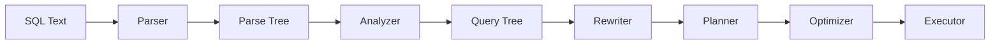
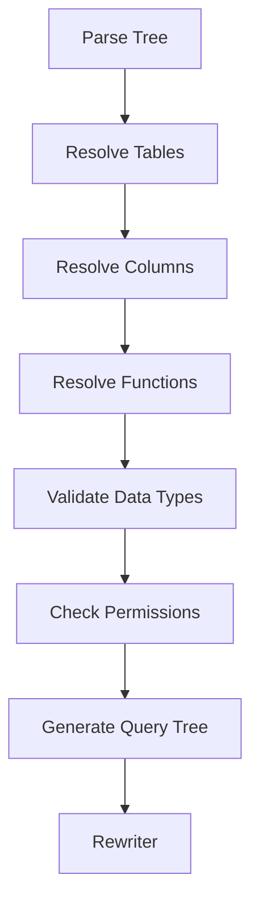
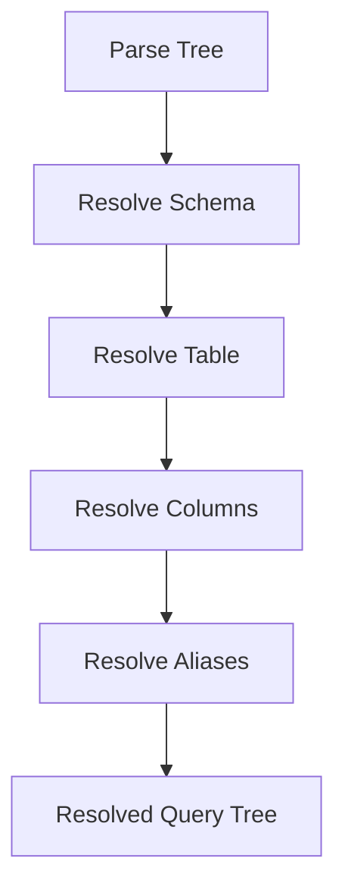
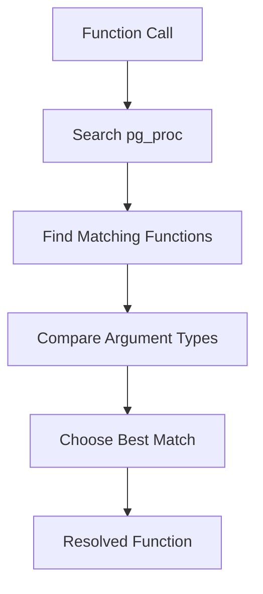
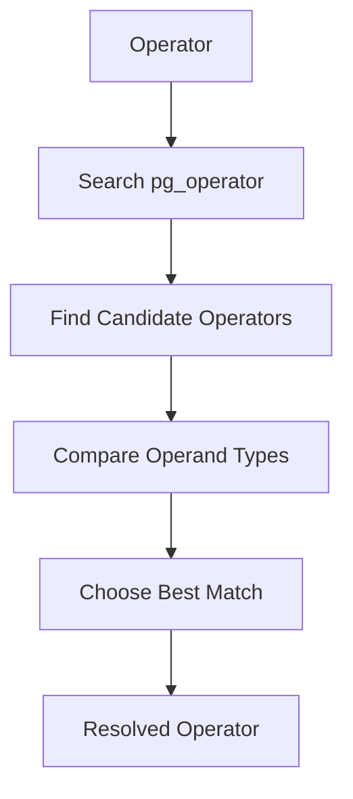
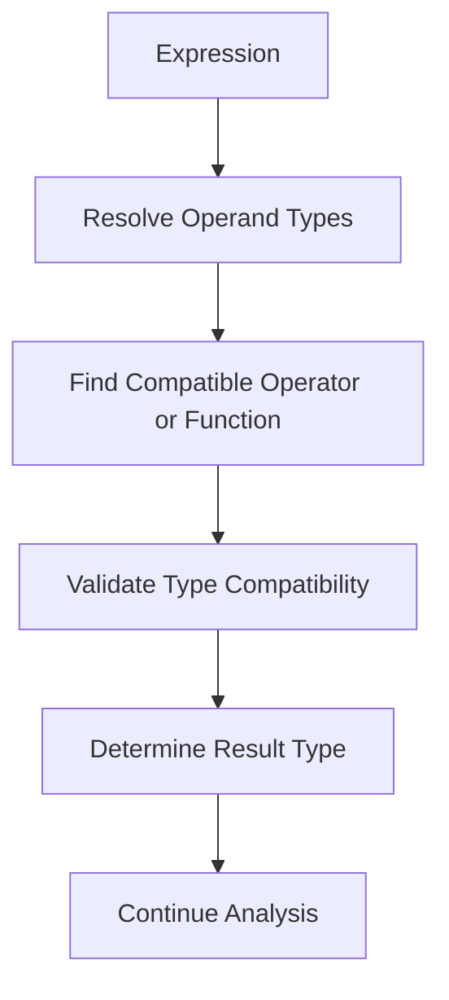
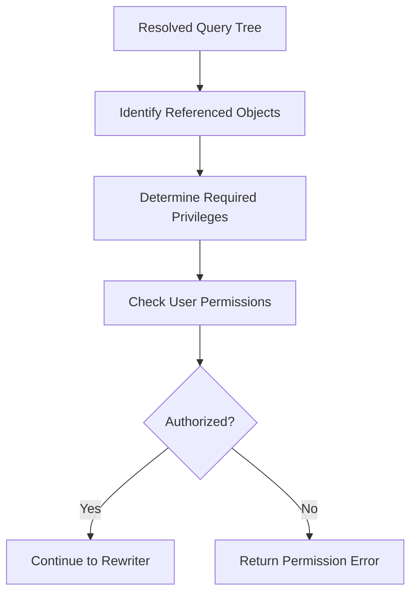
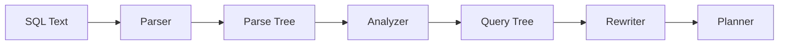
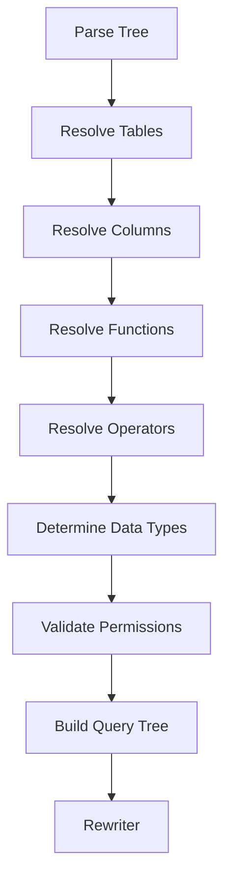
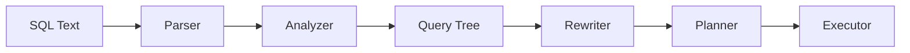

# Analyzer

> Learn how PostgreSQL verifies the meaning of a SQL statement by resolving database objects, validating data types, checking permissions, and transforming the Parse Tree into a Query Tree.

---

# Table of Contents

1. Introduction
2. Learning Objectives
3. Why PostgreSQL Needs an Analyzer
4. Semantic Analysis
5. Parse Tree vs Query Tree
6. Analyzer Workflow
7. Name Resolution
8. Summary

---

# Introduction

In the previous chapter, we learned how the **Parser** validates SQL syntax and creates a **Parse Tree**.

However, a syntactically correct SQL statement is not necessarily a valid SQL statement.

Consider the following query.

```sql
SELECT salary
FROM employee_data;
```

The Parser accepts this statement because the SQL grammar is correct.

But does the table `employee_data` actually exist?

That question cannot be answered by the Parser.

Instead, PostgreSQL passes the Parse Tree to the **Analyzer**.

The Analyzer performs **semantic analysis**, ensuring that the SQL statement is meaningful within the context of the current database.

---

# Learning Objectives

After completing this chapter, you will be able to:

- Explain the purpose of the Analyzer.
- Understand semantic analysis.
- Differentiate syntax errors from semantic errors.
- Describe the difference between a Parse Tree and a Query Tree.
- Understand how PostgreSQL resolves database objects.
- Explain why object validation is necessary before planning.

---

# Why PostgreSQL Needs an Analyzer

The Parser only verifies grammar.

It does **not** know whether:

- Tables exist.
- Columns exist.
- Functions exist.
- Operators are valid for the supplied data types.
- The user has permission to access the requested objects.

The Analyzer answers these questions before PostgreSQL spends time planning or executing the query.

Without semantic validation, PostgreSQL would attempt to build execution plans for invalid queries.

---

# Query Processing Pipeline



The Analyzer acts as the bridge between syntax validation and query optimization.

---

# What is Semantic Analysis?

Semantic analysis verifies that the SQL statement is logically meaningful.

Consider this query.

```sql
SELECT employee_name
FROM employees;
```

Semantic validation confirms:

- The table `employees` exists.
- The column `employee_name` exists.
- The current user has permission to access the table.
- The column belongs to the specified table.

Only after these checks succeed does PostgreSQL continue processing.

---

# Syntax Error vs Semantic Error

Understanding the difference between these two error types is essential.

### Syntax Error

```sql
SELECT
FROM employees;
```

Output

```text
ERROR:
syntax error at or near "FROM"
```

Cause:

The SQL grammar is invalid.

Detected by:

**Parser**

---

### Semantic Error

```sql
SELECT salary
FROM employee_data;
```

Output

```text
ERROR:
relation "employee_data" does not exist
```

Cause:

The SQL grammar is correct, but the referenced table does not exist.

Detected by:

**Analyzer**

---

# Parser vs Analyzer

| Parser | Analyzer |
|---------|----------|
| Checks SQL grammar | Checks SQL meaning |
| Produces Parse Tree | Produces Query Tree |
| Detects syntax errors | Detects semantic errors |
| Does not access system catalogs | Reads system catalogs to resolve objects |
| Does not validate permissions | Validates permissions |

---

# Parse Tree vs Query Tree

The Parse Tree represents the **structure** of the SQL statement.

Example:

```sql
SELECT employee_name
FROM employees;
```

Simplified Parse Tree

```text
SELECT Statement
│
├── Target List
│      └── employee_name
│
└── FROM
       └── employees
```

After semantic validation, PostgreSQL creates a **Query Tree**.

The Query Tree contains references to actual database objects instead of just SQL text.

Simplified Query Tree

```text
SELECT
│
├── Table:
│     employees (resolved)
│
├── Column:
│     employee_name (resolved)
│
└── Access Rights:
      verified
```

This enriched representation is passed to the Rewriter.

---

# Analyzer Workflow

The Analyzer performs several validation steps.



Each stage depends on the successful completion of the previous one.

If any step fails, PostgreSQL stops processing and returns an error.

---

# Business Example

A payroll application executes the following SQL.

```sql
SELECT employee_name,
       monthly_salary
FROM employees;
```

The Parser accepts the query because it follows SQL grammar.

During semantic analysis, PostgreSQL discovers that the column `monthly_salary` does not exist.

Execution stops immediately with an error.

No execution plan is generated.

No table scan occurs.

This early validation prevents wasted work and provides clear feedback to the application.

---

# Key Takeaways

- The Analyzer performs semantic validation.
- It receives the Parse Tree from the Parser.
- It resolves tables, columns, functions, and operators.
- It validates permissions and data types.
- It produces a Query Tree.
- It prevents invalid queries from reaching the Planner.


---

# Name Resolution

## Introduction

Once the Parser has confirmed that the SQL statement follows PostgreSQL grammar, the Analyzer begins resolving every database object referenced in the query.

This process is called **Name Resolution**.

Its purpose is to answer questions such as:

- Does this table exist?
- Does this column exist?
- Which schema contains this object?
- Is the object reference ambiguous?
- Which function should PostgreSQL execute?

Without Name Resolution, PostgreSQL would not know which database objects the SQL statement refers to.

---

# What is Name Resolution?

Name Resolution is the process of replacing textual object names with references to actual database objects stored in PostgreSQL's system catalogs.

For example, consider the query:

```sql
SELECT employee_name
FROM employees;
```

Initially, the Parse Tree only contains the text:

```text
employees
employee_name
```

The Analyzer looks up these names in PostgreSQL's metadata and replaces them with internal object references.

---

# Why Name Resolution is Necessary

Imagine PostgreSQL receives:

```sql
SELECT salary
FROM employees;
```

Questions the Analyzer must answer:

- Does a table named `employees` exist?
- Which schema contains it?
- Does the table contain a column named `salary`?
- Is `salary` unique or ambiguous?
- Can the current user access it?

Only after answering these questions can PostgreSQL safely continue.

---

# PostgreSQL System Catalogs

PostgreSQL stores information about every database object in special system tables called **system catalogs**.

Some important catalogs include:

| Catalog | Purpose |
|----------|---------|
| `pg_class` | Tables, indexes, views, sequences |
| `pg_attribute` | Columns |
| `pg_namespace` | Schemas |
| `pg_proc` | Functions |
| `pg_type` | Data types |
| `pg_operator` | Operators |

During Name Resolution, PostgreSQL consults these catalogs to identify the requested objects.

---

# Table Resolution

Consider:

```sql
SELECT employee_name
FROM employees;
```

The Analyzer searches the system catalogs.

Simplified workflow:

```text
employees

↓

Search pg_class

↓

Table Found

↓

Continue Analysis
```

If the table cannot be found:

```sql
SELECT *
FROM employee_data;
```

Output:

```text
ERROR:
relation "employee_data" does not exist
```

The Parser accepted the SQL grammar, but the Analyzer rejected it because the table does not exist.

---

# Column Resolution

After resolving the table, PostgreSQL resolves each referenced column.

Example:

```sql
SELECT employee_name,
       salary
FROM employees;
```

Workflow:

```text
employees

↓

Locate table metadata

↓

Find employee_name

↓

Find salary

↓

Columns Resolved
```

If a column is missing:

```sql
SELECT monthly_salary
FROM employees;
```

Output:

```text
ERROR:
column "monthly_salary" does not exist
```

---

# Schema Resolution

A PostgreSQL database can contain multiple schemas.

Example:

```text
public.employees

hr.employees

archive.employees
```

If the SQL statement does not specify a schema:

```sql
SELECT *
FROM employees;
```

PostgreSQL searches according to the **search_path** configuration.

Example search path:

```text
hr

↓

public

↓

archive
```

The first matching object is selected.

If no matching object is found, an error is returned.

---

# Explicit Schema References

To avoid ambiguity, specify the schema explicitly.

Example:

```sql
SELECT *
FROM hr.employees;
```

Benefits:

- Improved readability
- No ambiguity
- Predictable object resolution
- Better maintainability

---

# Ambiguous Column Names

Consider:

```sql
SELECT department_id
FROM employees
JOIN departments
ON employees.department_id = departments.department_id;
```

Which `department_id` should PostgreSQL use?

Both tables contain the same column name.

Output:

```text
ERROR:
column reference "department_id" is ambiguous
```

Correct version:

```sql
SELECT employees.department_id
FROM employees
JOIN departments
ON employees.department_id = departments.department_id;
```

Or using aliases:

```sql
SELECT e.department_id
FROM employees e
JOIN departments d
ON e.department_id = d.department_id;
```

---

# Alias Resolution

Aliases provide temporary names for tables and columns.

Example:

```sql
SELECT e.employee_name
FROM employees e;
```

The Analyzer records:

```text
Alias

e

↓

employees
```

All future references to `e` are mapped back to the original table.

Aliases simplify complex queries and reduce typing.

---

# Column Alias Resolution

Example:

```sql
SELECT salary * 12 AS annual_salary
FROM employees;
```

The Analyzer associates:

```text
annual_salary

↓

salary * 12
```

The alias becomes available in later stages where permitted by SQL semantics.

---

# Internal Name Resolution Workflow



Each step depends on the successful completion of the previous step.

---

# Business Example

An HR reporting system executes:

```sql
SELECT employee_name,
       department_name
FROM employees e
JOIN departments d
ON e.department_id = d.department_id;
```

During Name Resolution, PostgreSQL:

1. Locates both tables.
2. Resolves the aliases `e` and `d`.
3. Resolves every referenced column.
4. Confirms there are no ambiguous references.
5. Produces a resolved Query Tree.

Only then does the query proceed to the Rewriter.

---

# Common Mistakes

❌ Referencing a table that does not exist.

✔ Verify the table name and schema.

---

❌ Referencing a non-existent column.

✔ Check the table definition.

---

❌ Omitting table aliases in multi-table queries.

✔ Use aliases to avoid ambiguity.

---

❌ Assuming PostgreSQL searches all schemas automatically.

✔ PostgreSQL follows the configured `search_path`.

---

# Best Practices

- Use meaningful table aliases.
- Qualify columns in JOIN queries.
- Specify schemas in production SQL when appropriate.
- Avoid ambiguous column references.
- Keep object names descriptive and consistent.

---

# Interview Questions

1. What is Name Resolution?
2. Which PostgreSQL system catalogs are used during Name Resolution?
3. What is `search_path`?
4. What happens if a table cannot be found?
5. What causes an ambiguous column error?
6. Why are aliases useful?
7. Why should schemas sometimes be specified explicitly?
8. Which stage performs Name Resolution?

---

# Summary

Name Resolution is a core responsibility of the PostgreSQL Analyzer. It maps table names, column names, schemas, and aliases to actual database objects using PostgreSQL's system catalogs. By resolving object references before planning, PostgreSQL ensures that every part of the query refers to valid, unambiguous database objects.


---

# Function Resolution

## Introduction

After resolving tables, schemas, columns, and aliases, the PostgreSQL Analyzer must determine **which function should actually be executed**.

At first glance, this may seem straightforward.

Consider the following query.

```sql
SELECT AVG(salary)
FROM employees;
```

Humans immediately recognize that `AVG()` calculates the average salary.

However, PostgreSQL must answer several important questions before execution:

- Does the function `AVG` exist?
- Which version of `AVG` should be used?
- Are the supplied arguments valid?
- Is there a better overload that matches the supplied data types?
- Does the current user have permission to execute the function?

This process is known as **Function Resolution**.

---

# What is Function Resolution?

Function Resolution is the process of identifying the exact PostgreSQL function that should be executed for a function call.

Instead of treating a function call as plain text, PostgreSQL searches its system catalogs and resolves the function to a unique internal object.

Example

```sql
SELECT UPPER(employee_name)
FROM employees;
```

The Analyzer must resolve:

```
UPPER

↓

Function Object

↓

Internal Function ID

↓

Ready for Execution
```

---

# Why Function Resolution is Necessary

Many PostgreSQL functions support multiple data types.

Example

```sql
ROUND(15.678, 2)
```

Another example

```sql
ROUND(15.678::numeric)
```

Although both use the same function name, PostgreSQL may execute different internal implementations depending on the argument types.

Therefore, simply matching the function name is not enough.

---

# PostgreSQL Function Catalog

Information about every function is stored in the system catalog:

```text
pg_proc
```

This catalog contains metadata such as:

- Function name
- Function schema
- Number of parameters
- Parameter data types
- Return type
- Volatility
- Language
- Owner
- Access privileges

During analysis, PostgreSQL searches `pg_proc` to locate the correct function definition.

---

# Function Lookup Workflow



If no suitable function exists, PostgreSQL reports an error.

---

# Example 1 — Valid Function

```sql
SELECT LENGTH(employee_name)
FROM employees;
```

Resolution process:

```text
LENGTH

↓

Search pg_proc

↓

Match Found

↓

Argument Type Verified

↓

Function Resolved
```

The query proceeds to the next stage.

---

# Example 2 — Function Does Not Exist

```sql
SELECT CALCULATE(salary)
FROM employees;
```

Output

```text
ERROR:
function calculate(integer) does not exist
```

The SQL grammar is correct.

The error occurs because PostgreSQL cannot find a function named `CALCULATE` that matches the supplied argument type.

---

# Function Overloading

PostgreSQL supports **function overloading**.

Multiple functions can share the same name if their parameter lists differ.

Example

```text
ABS(integer)

ABS(numeric)

ABS(double precision)
```

When PostgreSQL encounters:

```sql
SELECT ABS(-10);
```

it chooses:

```text
ABS(integer)
```

When it encounters:

```sql
SELECT ABS(-10.75);
```

it chooses:

```text
ABS(numeric)
```

The Analyzer selects the most appropriate overload based on argument types.

---

# Argument Validation

Suppose the function expects two parameters.

```sql
POWER(base, exponent)
```

Correct

```sql
SELECT POWER(5,2);
```

Incorrect

```sql
SELECT POWER(5);
```

Output

```text
ERROR:
function power(integer) does not exist
```

The supplied argument list does not match any available overload.

---

# Type Compatibility

Sometimes PostgreSQL performs implicit type conversion.

Example

```sql
SELECT LENGTH('PostgreSQL');
```

The string literal is automatically treated as a text value.

In other situations, implicit conversion is not possible.

Example

```sql
SELECT SQRT('Hello');
```

Output

```text
ERROR:
function sqrt(unknown) does not exist
```

The supplied argument cannot be converted into a numeric type required by `SQRT`.

---

# Schema-qualified Functions

Functions can exist in different schemas.

Example

```sql
SELECT math.calculate_tax(1000);
```

Here:

```
math

↓

Schema

↓

calculate_tax

↓

Function
```

Specifying the schema avoids ambiguity and ensures PostgreSQL resolves the intended function.

---

# Aggregate Function Resolution

Aggregate functions also undergo function resolution.

Example

```sql
SELECT
AVG(salary)
FROM employees;
```

The Analyzer verifies:

- `AVG` exists.
- `salary` is a valid column.
- The column data type supports aggregation.
- The return type is appropriate.

Only then does execution continue.

---

# Business Example

An accounting system stores a custom function:

```sql
calculate_bonus(employee_id)
```

A report executes:

```sql
SELECT
employee_name,
calculate_bonus(employee_id)
FROM employees;
```

The Analyzer:

1. Searches `pg_proc`.
2. Finds `calculate_bonus(integer)`.
3. Verifies the argument type.
4. Confirms execution permissions.
5. Adds the resolved function reference to the Query Tree.

---

# Common Mistakes

❌ Calling a function that does not exist.

✔ Verify the function name and schema.

---

❌ Passing the wrong number of arguments.

✔ Match the function signature.

---

❌ Passing incompatible data types.

✔ Use explicit casting when necessary.

---

❌ Assuming PostgreSQL chooses a random overload.

✔ PostgreSQL follows deterministic overload resolution rules.

---

# Best Practices

- Use built-in functions whenever possible.
- Choose descriptive names for custom functions.
- Avoid creating overloaded functions with confusing signatures.
- Schema-qualify custom functions in large applications.
- Validate argument types before calling functions.

---

# Interview Questions

1. What is Function Resolution?
2. Which system catalog stores PostgreSQL functions?
3. What is function overloading?
4. How does PostgreSQL choose between overloaded functions?
5. What happens if no matching function exists?
6. Why are argument types important?
7. Why should custom functions sometimes be schema-qualified?
8. Which stage performs Function Resolution?

---

# Summary

Function Resolution is a critical responsibility of the PostgreSQL Analyzer. It maps every function call in a SQL statement to the correct function definition stored in `pg_proc`. By validating function names, argument counts, data types, overloads, and permissions, PostgreSQL ensures that function calls are semantically correct before query planning begins.


---

# Operator Resolution

## Introduction

SQL operators appear simple to users.

Examples include:

```sql
+
-
*
/
=
<>
!=
<
>
<=
>=
AND
OR
NOT
LIKE
IN
BETWEEN
```

However, PostgreSQL does not treat an operator as a simple symbol.

Every operator is an actual database object stored in PostgreSQL's system catalogs.

Before execution, the Analyzer must determine:

- Which operator is being used?
- Does the operator exist?
- Which data types does it support?
- Is there an overloaded version that better matches the supplied operands?
- What data type will the operator return?

This process is known as **Operator Resolution**.

---

# What is Operator Resolution?

Operator Resolution is the process of mapping an operator in a SQL statement to the correct internal PostgreSQL operator definition.

Consider the following expression.

```sql
salary + bonus
```

The Analyzer transforms this into something conceptually similar to:

```text
+

↓

Operator Definition

↓

Operand Types Verified

↓

Return Type Determined

↓

Resolved Operator
```

Only after this resolution can PostgreSQL safely continue.

---

# Why Operator Resolution is Necessary

The same operator may behave differently depending on the operand types.

Example

```sql
5 + 10
```

Performs integer addition.

---

Example

```sql
5.5 + 10.2
```

Performs numeric addition.

---

Example

```sql
DATE '2026-01-01' + INTERVAL '7 days'
```

Produces another date/time value.

---

Although every expression uses the **+** symbol, PostgreSQL executes different internal operator implementations.

---

# PostgreSQL Operator Catalog

All operators are stored in:

```text
pg_operator
```

Each operator definition includes information such as:

- Operator symbol
- Left operand type
- Right operand type
- Result type
- Associated implementation function
- Operator properties

During analysis, PostgreSQL searches this catalog to find the correct operator.

---

# Operator Resolution Workflow



If PostgreSQL cannot find a compatible operator, the query is rejected.

---

# Example 1 — Integer Addition

```sql
SELECT 5 + 10;
```

Resolution

```text
+

↓

integer + integer

↓

integer
```

The Analyzer selects the integer addition operator.

---

# Example 2 — Numeric Addition

```sql
SELECT 5.25 + 8.75;
```

Resolution

```text
+

↓

numeric + numeric

↓

numeric
```

A different operator implementation is selected.

---

# Example 3 — Date Arithmetic

```sql
SELECT DATE '2026-01-01'
     + INTERVAL '10 days';
```

Resolution

```text
+

↓

date + interval

↓

timestamp
```

Although the operator symbol is identical, PostgreSQL resolves a completely different operator definition.

---

# Comparison Operators

Comparison operators also require resolution.

Example

```sql
SELECT *
FROM employees
WHERE salary > 50000;
```

The Analyzer verifies:

- `salary` is numeric.
- `50000` is compatible.
- The `>` operator exists for those data types.
- The operator returns a Boolean result.

---

# String Operators

Example

```sql
SELECT
first_name || ' ' || last_name
FROM employees;
```

The `||` operator performs string concatenation.

The Analyzer resolves:

```text
text || text

↓

text
```

This is different from numeric addition even though both are binary operators.

---

# Logical Operators

Example

```sql
SELECT *
FROM employees
WHERE salary > 50000
AND department = 'IT';
```

The Analyzer verifies:

- Both comparison expressions return Boolean values.
- The `AND` operator accepts Boolean operands.
- The final result is also Boolean.

---

# Invalid Operator Example

```sql
SELECT 'Hello' - 'World';
```

Output

```text
ERROR:
operator does not exist:
text - text
```

The SQL syntax is valid.

However, PostgreSQL cannot find a subtraction operator for two text values.

This is a semantic error detected by the Analyzer.

---

# Operator Overloading

Like functions, operators can be overloaded.

The **+** operator has many implementations, including:

```text
integer + integer

numeric + numeric

date + interval

timestamp + interval

money + money
```

The Analyzer selects the most appropriate implementation based on operand types.

---

# Implicit Type Conversion

Sometimes PostgreSQL automatically converts operands.

Example

```sql
SELECT 10 + 5.5;
```

Conceptually:

```text
10

↓

10.0

↓

numeric + numeric
```

Implicit conversion allows compatible expressions to work without requiring explicit casts.

---

# Operator Precedence

The Analyzer also respects SQL operator precedence.

Example

```sql
SELECT 5 + 2 * 3;
```

Evaluation order:

```text
2 * 3

↓

6

↓

5 + 6

↓

11
```

Parentheses override the default precedence.

Example

```sql
SELECT (5 + 2) * 3;
```

Result:

```text
21
```

---

# Business Example

An inventory system calculates stock value.

```sql
SELECT
quantity * unit_price
FROM inventory;
```

The Analyzer verifies:

- `quantity` is numeric.
- `unit_price` is numeric.
- Multiplication is defined for those types.
- The result type is valid for further processing.

Only then is the expression added to the Query Tree.

---

# Common Mistakes

❌ Assuming every `+` operator is identical.

✔ PostgreSQL resolves different implementations based on operand types.

---

❌ Using incompatible data types.

✔ Ensure operators support the supplied operands.

---

❌ Ignoring implicit conversions.

✔ Understand when PostgreSQL performs automatic type conversion and when it does not.

---

❌ Confusing syntax errors with operator resolution errors.

✔ An unknown or incompatible operator is a semantic error, not a syntax error.

---

# Best Practices

- Use compatible data types in expressions.
- Add explicit casts when conversions may be ambiguous.
- Use parentheses to make operator precedence clear.
- Avoid relying on implicit conversions in complex queries.
- Write expressions that clearly communicate intent.

---

# Interview Questions

1. What is Operator Resolution?
2. Which PostgreSQL system catalog stores operator definitions?
3. Why can the `+` operator have multiple implementations?
4. What is operator overloading?
5. What happens if PostgreSQL cannot resolve an operator?
6. How does implicit type conversion affect operator resolution?
7. Why is operator precedence important?
8. Which stage performs Operator Resolution?

---

# Summary

Operator Resolution is a key responsibility of the PostgreSQL Analyzer. It maps SQL operators to the correct internal definitions stored in `pg_operator`, validates operand types, determines result types, and supports overloaded operators. By resolving operators before planning, PostgreSQL ensures that expressions are both meaningful and type-safe.


---

# Type Checking

## Introduction

After resolving tables, columns, functions, and operators, PostgreSQL must ensure that every expression in the SQL statement uses **compatible data types**.

This process is called **Type Checking**.

Although a SQL statement may have:

- Correct syntax
- Valid table names
- Valid column names
- Valid functions
- Valid operators

it can still fail if the participating data types are incompatible.

Type Checking prevents PostgreSQL from executing expressions that have no valid meaning.

---

# What is Type Checking?

Type Checking is the process of verifying that every operation in a SQL statement is valid for the supplied data types.

For example:

```sql
SELECT salary * 12
FROM employees;
```

The Analyzer verifies:

- `salary` is a numeric data type.
- `12` is a numeric literal.
- Multiplication is supported.
- The result has a valid data type.

If all checks succeed, PostgreSQL continues processing.

---

# Why Type Checking is Necessary

Consider the following query.

```sql
SELECT 'Hello' * 5;
```

Grammar?

✔ Valid

Table Resolution?

✔ Not applicable

Operator Resolution?

✘ Invalid

Reason:

A text value cannot be multiplied by an integer.

Output

```text
ERROR:
operator does not exist:
text * integer
```

The Analyzer detects this semantic error before planning begins.

---

# Type Checking Workflow



If any validation step fails, query processing stops immediately.

---

# Example 1 — Numeric Expression

```sql
SELECT salary + bonus
FROM employees;
```

Analyzer checks:

```text
salary

↓

numeric

bonus

↓

numeric

↓

Addition Supported

↓

Result = numeric
```

The expression is valid.

---

# Example 2 — Invalid Arithmetic

```sql
SELECT employee_name + salary
FROM employees;
```

Suppose:

```
employee_name

↓

text

salary

↓

numeric
```

Output

```text
ERROR:
operator does not exist:
text + numeric
```

The operands are incompatible for the `+` operator.

---

# Example 3 — Comparison

```sql
SELECT *
FROM employees
WHERE salary > 50000;
```

Validation:

```
salary

↓

numeric

50000

↓

integer

↓

Compatible Comparison

↓

Boolean Result
```

The expression is accepted.

---

# Example 4 — Invalid Comparison

```sql
SELECT *
FROM employees
WHERE employee_name > 50000;
```

Suppose:

```
employee_name

↓

text

50000

↓

integer
```

Output

```text
ERROR:
operator does not exist:
text > integer
```

The comparison is invalid because the data types are incompatible.

---

# Function Type Checking

Functions also undergo type validation.

Example

```sql
SELECT SQRT(salary)
FROM employees;
```

Validation:

- `salary` is numeric.
- `SQRT()` accepts numeric input.
- Return type is numeric.

Valid.

---

Incorrect

```sql
SELECT SQRT(employee_name)
FROM employees;
```

Output

```text
ERROR:
function sqrt(text) does not exist
```

The function cannot accept a text argument.

---

# Aggregate Type Checking

Example

```sql
SELECT AVG(salary)
FROM employees;
```

Validation:

- `salary` exists.
- Data type supports averaging.
- Aggregate returns numeric.

Valid.

---

Incorrect

```sql
SELECT AVG(employee_name)
FROM employees;
```

Output

```text
ERROR:
function avg(text) does not exist
```

Text values cannot be averaged.

---

# Boolean Expression Validation

Conditions inside `WHERE` clauses must evaluate to a Boolean result.

Correct

```sql
SELECT *
FROM employees
WHERE salary > 50000;
```

Result:

```text
Boolean
```

Incorrect

```sql
SELECT *
FROM employees
WHERE salary + 100;
```

Output

```text
ERROR:
argument of WHERE must be type boolean
```

The `WHERE` clause requires a Boolean expression, not a numeric value.

---

# Assignment Type Checking

Example

```sql
UPDATE employees
SET salary = 65000;
```

Validation:

```
salary

↓

numeric

65000

↓

integer

↓

Compatible Assignment
```

Valid.

---

Incorrect

```sql
UPDATE employees
SET salary = 'Manager';
```

Output

```text
ERROR:
invalid input syntax for type numeric
```

A text value cannot be assigned to a numeric column.

---

# Return Type Determination

Every expression has a resulting data type.

Example

```sql
SELECT salary * 12;
```

```
numeric

×

integer

↓

numeric
```

Another example

```sql
SELECT salary > 50000;
```

```
numeric

>

numeric

↓

boolean
```

The Analyzer records these result types in the Query Tree for later stages.

---

# Business Example

An accounting system calculates annual salaries.

```sql
SELECT
salary * 12 AS annual_salary
FROM employees;
```

The Analyzer verifies:

1. `salary` exists.
2. `salary` is numeric.
3. Multiplication is valid.
4. The result is numeric.
5. The alias `annual_salary` is associated with the expression.

The validated expression is stored in the Query Tree.

---

# Common Mistakes

❌ Mixing text and numeric values in arithmetic expressions.

✔ Use compatible numeric types.

---

❌ Comparing incompatible data types.

✔ Ensure both operands support the comparison operator.

---

❌ Passing incorrect argument types to functions.

✔ Verify function signatures before use.

---

❌ Forgetting that `WHERE` requires a Boolean result.

✔ Every `WHERE` condition must evaluate to `TRUE`, `FALSE`, or `NULL`.

---

# Best Practices

- Use appropriate data types for each column.
- Keep arithmetic expressions numeric.
- Use explicit casts when necessary.
- Validate function parameter types.
- Design schemas with consistent data types to reduce unnecessary conversions.

---

# Interview Questions

1. What is Type Checking?
2. Which stage performs Type Checking?
3. Why is Type Checking necessary?
4. Can a query have valid syntax but fail Type Checking?
5. Why must a `WHERE` clause evaluate to a Boolean value?
6. How does PostgreSQL determine the result type of an expression?
7. Why are function arguments type-checked?
8. What happens when incompatible types are used together?

---

# Summary

Type Checking is a fundamental responsibility of the PostgreSQL Analyzer. It ensures that operators, functions, comparisons, assignments, and expressions are used with compatible data types. By validating type compatibility and determining result types before planning begins, PostgreSQL prevents invalid operations and guarantees that only semantically correct queries move forward through the execution pipeline.


---

# Type Casting

## Introduction

In the previous section, we learned that PostgreSQL verifies whether data types are compatible before executing a query.

However, not all expressions involve operands of the same data type.

Consider the following query.

```sql
SELECT 10 + 5.5;
```

The operands have different types.

```
10

↓

integer
```

```
5.5

↓

numeric
```

Yet PostgreSQL executes the query successfully.

How?

The Analyzer performs **Type Casting**, converting one data type into another when appropriate.

---

# What is Type Casting?

Type Casting is the process of converting a value from one data type to another.

PostgreSQL supports two types of casting:

1. Implicit Casting
2. Explicit Casting

Type casting enables PostgreSQL to evaluate expressions involving different but compatible data types.

---

# Why Type Casting is Necessary

Suppose PostgreSQL did not support casting.

The following query would fail.

```sql
SELECT 10 + 5.5;
```

Because:

```
integer

+

numeric
```

would not be directly compatible.

Instead, PostgreSQL converts the integer value into a numeric value.

Conceptually:

```text
10

↓

10.0

↓

numeric

+

5.5

↓

numeric
```

Now both operands have compatible data types.

---

# Implicit Type Casting

An **implicit cast** is performed automatically by PostgreSQL when the conversion is safe and unambiguous.

Example

```sql
SELECT 10 + 5.5;
```

Conceptual process:

```text
integer

↓

numeric

↓

numeric + numeric

↓

numeric
```

The user does not need to write any casting syntax.

---

# Another Implicit Cast

```sql
SELECT salary > 50000;
```

Suppose:

```
salary

↓

numeric
```

```
50000

↓

integer
```

The integer literal is automatically converted into a compatible numeric value before comparison.

---

# Explicit Type Casting

Sometimes PostgreSQL cannot safely determine the desired conversion.

In these cases, the user must specify the target data type.

Example

```sql
SELECT '100'::integer;
```

Output

```
100
```

Here:

```
text

↓

integer
```

The conversion is explicitly requested.

---

# CAST() Function

PostgreSQL also supports the standard SQL `CAST()` function.

Example

```sql
SELECT CAST('100' AS INTEGER);
```

This produces the same result as:

```sql
SELECT '100'::integer;
```

Both forms are valid.

The `::` syntax is PostgreSQL-specific, while `CAST()` follows the SQL standard.

---

# Successful Explicit Cast

```sql
SELECT
CAST('250.75' AS NUMERIC);
```

Result

```
250.75
```

The Analyzer verifies:

- Source type: text
- Target type: numeric
- Conversion exists

The expression is accepted.

---

# Failed Explicit Cast

```sql
SELECT
CAST('Hello' AS INTEGER);
```

Output

```text
ERROR:
invalid input syntax for type integer:
"Hello"
```

Although the cast syntax is correct, PostgreSQL cannot convert the supplied value into an integer.

---

# Implicit vs Explicit Casting

| Feature | Implicit Cast | Explicit Cast |
|----------|---------------|---------------|
| Performed Automatically | ✔ | ✘ |
| Written by User | ✘ | ✔ |
| Safe Conversions Only | ✔ | User Controlled |
| Syntax Required | ✘ | ✔ |

---

# Casting During Function Resolution

Example

```sql
SELECT ABS(10);
```

Suppose the best available function accepts a numeric value.

Conceptually:

```text
10

↓

integer

↓

numeric

↓

ABS(numeric)
```

The implicit conversion allows PostgreSQL to resolve the correct function.

---

# Casting During Operator Resolution

Example

```sql
SELECT 25 + 10.5;
```

Conceptually:

```text
25

↓

integer

↓

numeric

↓

numeric + numeric
```

The Analyzer inserts the implicit conversion before selecting the operator implementation.

---

# Date and Time Casting

Example

```sql
SELECT
CAST('2026-07-30' AS DATE);
```

Result

```
2026-07-30
```

Another example

```sql
SELECT
'2026-07-30'::DATE;
```

Both statements produce a DATE value.

---

# Boolean Casting

Example

```sql
SELECT
CAST('true' AS BOOLEAN);
```

Result

```
true
```

Similarly,

```sql
SELECT
'false'::BOOLEAN;
```

returns a Boolean value.

---

# Invalid Cast Example

```sql
SELECT
'ABC'::DATE;
```

Output

```text
ERROR:
invalid input syntax for type date
```

The syntax is valid.

The conversion itself is impossible.

---

# Business Example

A CSV import stores salary values as text.

```text
salary

↓

'65000'
```

To perform calculations:

```sql
SELECT
CAST(salary AS NUMERIC)
FROM imported_employees;
```

The Analyzer verifies that the conversion exists before allowing arithmetic operations.

Without the cast, mathematical expressions may fail or produce unexpected behavior.

---

# Performance Considerations

Frequent casting can affect query performance.

Example

```sql
SELECT *
FROM employees
WHERE CAST(employee_id AS TEXT) = '100';
```

If `employee_id` is indexed as an integer, casting the column may prevent PostgreSQL from using that index efficiently.

A better approach is:

```sql
SELECT *
FROM employees
WHERE employee_id = 100;
```

Whenever possible:

- Store data using appropriate types.
- Avoid unnecessary casts in filtering conditions.
- Let PostgreSQL use indexes naturally.

---

# Common Mistakes

❌ Assuming PostgreSQL can convert every value automatically.

✔ Only safe and well-defined conversions are performed implicitly.

---

❌ Relying excessively on implicit casts.

✔ Use explicit casts when the intended conversion is not obvious.

---

❌ Casting indexed columns unnecessarily.

✔ Cast literals or parameters instead of indexed columns when possible.

---

❌ Ignoring conversion failures.

✔ Validate input data before casting.

---

# Best Practices

- Choose appropriate column data types during database design.
- Prefer explicit casts when code clarity is important.
- Avoid unnecessary conversions inside `WHERE` clauses.
- Use the SQL-standard `CAST()` syntax when portability matters.
- Use PostgreSQL's `::` syntax for concise PostgreSQL-specific code.

---

# Interview Questions

1. What is Type Casting?
2. What is the difference between implicit and explicit casting?
3. When does PostgreSQL perform implicit casting?
4. What is the difference between `CAST()` and `::`?
5. Can every data type be converted to every other data type?
6. How does Type Casting affect Function Resolution?
7. Why can unnecessary casts reduce performance?
8. Which stage performs Type Casting?

---

# Summary

Type Casting is the process of converting values between compatible data types during semantic analysis. PostgreSQL performs implicit casts when conversions are safe and unambiguous, while explicit casts allow users to request specific conversions using `CAST()` or the PostgreSQL-specific `::` syntax. Proper use of type casting improves query correctness, readability, and performance while ensuring that operators and functions receive compatible input types.


---

# Permission Validation

## Introduction

By this point, the Analyzer has verified that:

- The SQL syntax is correct.
- Tables and schemas exist.
- Columns have been resolved.
- Functions and operators are valid.
- Data types are compatible.

However, one critical question remains:

> **Is the current user allowed to access these database objects?**

A query can be syntactically and semantically correct, yet still fail because the user does not have the required privileges.

Checking these privileges is the responsibility of **Permission Validation**.

---

# What is Permission Validation?

Permission Validation is the process of verifying that the current database user has the required privileges to perform the requested operation.

Examples of operations include:

- Reading data (`SELECT`)
- Inserting rows (`INSERT`)
- Updating rows (`UPDATE`)
- Deleting rows (`DELETE`)
- Executing functions (`EXECUTE`)
- Using sequences (`USAGE`)

If the required privilege is missing, PostgreSQL stops processing the query before planning and execution.

---

# Why Permission Validation is Necessary

Consider the following query.

```sql
SELECT *
FROM employees;
```

The Analyzer has already confirmed:

- `employees` exists.
- The table structure is valid.
- The query is semantically correct.

Now PostgreSQL checks:

> Does the current user have the `SELECT` privilege on `employees`?

If the answer is **No**, the query is rejected.

---

# Permission Validation Workflow



Permission checks occur before the Planner generates an execution plan.

---

# Object-Level Permissions

Every referenced database object may require its own privilege.

Examples:

| Object | Typical Privilege |
|----------|------------------|
| Table | SELECT, INSERT, UPDATE, DELETE |
| View | SELECT |
| Sequence | USAGE, SELECT |
| Function | EXECUTE |
| Schema | USAGE |
| Database | CONNECT |

The Analyzer checks each object independently.

---

# Example 1 — SELECT Permission

```sql
SELECT employee_name
FROM employees;
```

Validation:

```
employees

↓

SELECT privilege?

↓

Yes

↓

Continue
```

If permission is missing:

```text
ERROR:
permission denied for table employees
```

---

# Example 2 — UPDATE Permission

```sql
UPDATE employees
SET salary = salary * 1.10;
```

Required privilege:

```
UPDATE
```

If the user lacks this privilege:

```text
ERROR:
permission denied for table employees
```

No rows are modified.

---

# Example 3 — INSERT Permission

```sql
INSERT INTO employees
VALUES (101,'Rahul',65000);
```

Required privilege:

```
INSERT
```

If the privilege is unavailable, PostgreSQL rejects the statement before execution.

---

# Example 4 — DELETE Permission

```sql
DELETE
FROM employees
WHERE employee_id = 101;
```

Required privilege:

```
DELETE
```

Again, permission is verified before any rows are removed.

---

# Function Execution Permissions

Functions also require permissions.

Example

```sql
SELECT calculate_bonus(employee_id)
FROM employees;
```

The Analyzer verifies:

- The function exists.
- The argument types are valid.
- The current user has the `EXECUTE` privilege.

If not:

```text
ERROR:
permission denied for function calculate_bonus
```

---

# Schema Permissions

Before accessing an object inside a schema, PostgreSQL verifies that the user has permission to use that schema.

Example

```sql
SELECT *
FROM hr.employees;
```

Checks:

```
Schema

↓

USAGE

↓

Table

↓

SELECT
```

Both permissions are required.

---

# Column-Level Permissions

Privileges can also be granted on individual columns.

Example

```sql
SELECT salary
FROM employees;
```

If the user has permission to access the table but **not** the `salary` column:

```text
ERROR:
permission denied for column salary
```

This allows administrators to protect sensitive data without restricting access to the entire table.

---

# Multiple Object Validation

Consider the following query.

```sql
SELECT
e.employee_name,
d.department_name
FROM employees e
JOIN departments d
ON e.department_id = d.department_id;
```

The Analyzer checks permissions for:

- `employees`
- `departments`
- Referenced columns
- Functions (if any)
- Schemas

Every referenced object must pass permission validation.

---

# Business Example

An HR database contains confidential salary information.

Employee table:

```text
employee_name

salary

department
```

Managers have permission:

```text
SELECT employee_name

SELECT salary
```

Regular employees have permission:

```text
SELECT employee_name

SELECT department
```

When a regular employee executes:

```sql
SELECT salary
FROM employees;
```

PostgreSQL returns:

```text
ERROR:
permission denied for column salary
```

The query is blocked before planning or execution.

---

# How PostgreSQL Stores Permissions

Privileges are stored in PostgreSQL's system catalogs and are associated with:

- Roles
- Users
- Groups
- Database objects

The Analyzer consults this metadata during semantic analysis to determine whether access should be granted.

---

# Common Mistakes

❌ Assuming a valid query will always execute.

✔ Semantic correctness does not imply sufficient privileges.

---

❌ Forgetting schema permissions.

✔ Accessing an object requires permission on both the schema and the object.

---

❌ Assuming table permission automatically grants access to every column.

✔ Column-level privileges may further restrict access.

---

❌ Granting excessive permissions.

✔ Follow the principle of least privilege whenever possible.

---

# Best Practices

- Grant only the privileges users actually need.
- Use roles instead of assigning permissions directly to many users.
- Restrict access to sensitive columns such as salaries or personal information.
- Review permissions regularly.
- Schema-qualify important objects to make access paths explicit.

---

# Interview Questions

1. What is Permission Validation?
2. Which stage checks user privileges?
3. Why does PostgreSQL validate permissions before planning?
4. Can a user have permission on a table but not on a specific column?
5. Which privilege is required to execute a function?
6. Why is `USAGE` required on a schema?
7. What happens if permission validation fails?
8. What is the principle of least privilege?

---

# Summary

Permission Validation is a critical part of semantic analysis. The PostgreSQL Analyzer verifies that the current user has the required privileges to access every referenced object, including tables, columns, schemas, functions, and sequences. By enforcing access control before planning and execution, PostgreSQL protects database security while avoiding unnecessary processing of unauthorized queries.


---

# Query Tree Generation

## Introduction

At this point, the PostgreSQL Analyzer has successfully completed every semantic validation step.

It has verified:

- SQL grammar (handled earlier by the Parser)
- Table existence
- Schema resolution
- Column resolution
- Alias resolution
- Function resolution
- Operator resolution
- Data type compatibility
- Type casting
- Permission validation

The final responsibility of the Analyzer is to generate a **Query Tree**.

The Query Tree is an enriched, semantically validated representation of the original SQL statement.

Unlike the Parse Tree, which primarily reflects SQL grammar, the Query Tree contains references to actual database objects and resolved metadata that later stages can use efficiently.

---

# What is a Query Tree?

A **Query Tree** is PostgreSQL's internal representation of a SQL statement after semantic analysis has been completed.

It contains:

- Resolved table references
- Resolved column references
- Resolved function references
- Resolved operator references
- Data type information
- Alias mappings
- Permission validation status
- Expression metadata

Instead of storing SQL as text, PostgreSQL stores structured nodes representing each part of the query.

---

# Parse Tree vs Query Tree

| Parse Tree | Query Tree |
|------------|------------|
| Generated by Parser | Generated by Analyzer |
| Represents SQL grammar | Represents SQL semantics |
| Contains textual object names | Contains resolved database object references |
| No permission information | Permission validation completed |
| No data type information | Data types resolved |
| No function resolution | Functions resolved |
| No operator resolution | Operators resolved |

---

# Query Processing Flow



The Query Tree becomes the input for the **Rewriter**, which applies rules, expands views, and prepares the query for optimization.

---

# Example Query

```sql
SELECT employee_name
FROM employees
WHERE salary > 50000;
```

---

## Simplified Parse Tree

```text
SELECT Statement
│
├── Target List
│      └── employee_name
│
├── FROM
│      └── employees
│
└── WHERE
       └── salary > 50000
```

Notice that the tree only represents the grammatical structure.

---

## Simplified Query Tree

```text
SELECT
│
├── Target List
│      └── Column Reference
│             Object ID: employee_name
│             Type: text
│
├── FROM
│      └── Table Reference
│             Object ID: employees
│
├── WHERE
│      └── Operator: >
│             Left Type : numeric
│             Right Type: numeric
│             Return    : boolean
│
└── Permissions
       SELECT Verified
```

The Query Tree contains significantly more information than the Parse Tree.

---

# Internal Query Tree Workflow



Each stage enriches the tree with additional semantic information.

---

# Expression Nodes

Expressions become dedicated nodes within the Query Tree.

Example

```sql
SELECT salary * 12
FROM employees;
```

Simplified representation

```text
Expression
│
├── Operator
│      *
│
├── Left Operand
│      salary
│
├── Right Operand
│      12
│
└── Result Type
       numeric
```

Later stages no longer need to interpret raw SQL—they work directly with these structured nodes.

---

# JOIN Representation

Example

```sql
SELECT
e.employee_name,
d.department_name
FROM employees e
JOIN departments d
ON e.department_id = d.department_id;
```

Simplified Query Tree

```text
SELECT
│
├── FROM
│      employees
│
├── JOIN
│      departments
│
├── Join Condition
│      e.department_id = d.department_id
│
└── Target List
       employee_name
       department_name
```

The Query Tree stores the logical relationship between objects, making it easier for the Planner to evaluate different execution strategies.

---

# Function Nodes

Example

```sql
SELECT AVG(salary)
FROM employees;
```

Simplified node

```text
Aggregate Function
│
├── Function
│      AVG
│
├── Argument
│      salary
│
└── Return Type
       numeric
```

---

# Query Tree Benefits

Using a structured Query Tree provides several advantages.

### 1. Eliminates Repeated Validation

Semantic checks do not need to be repeated in later stages.

---

### 2. Simplifies Query Rewriting

The Rewriter modifies tree nodes instead of editing SQL text.

---

### 3. Improves Planning

The Planner receives resolved object references instead of textual names.

---

### 4. Enables Optimization

The Optimizer estimates costs using metadata already stored in the Query Tree.

---

### 5. Improves Reliability

Because every object has already been validated, later stages can focus entirely on execution planning.

---

# Business Example

An online retail system executes the following query.

```sql
SELECT
customer_name,
SUM(order_total)
FROM orders
GROUP BY customer_name;
```

Before planning begins, the Analyzer generates a Query Tree containing:

- The resolved `orders` table.
- The resolved `customer_name` column.
- The resolved `SUM()` aggregate function.
- Data types for every expression.
- Grouping metadata.
- Permission validation.

The Planner can immediately begin evaluating execution strategies without rechecking semantic correctness.

---

# Common Misconceptions

❌ The Query Tree stores query results.

✔ It stores only the structure and semantic information required for planning.

---

❌ The Planner still validates table names.

✔ Table resolution is completed during analysis.

---

❌ The Query Tree is identical to the Parse Tree.

✔ The Query Tree contains much richer information.

---

❌ PostgreSQL executes SQL directly from the Parse Tree.

✔ The Rewriter and Planner work with the Query Tree.

---

# Best Practices

- Use clear object names to simplify resolution.
- Avoid ambiguous references.
- Use aliases consistently in complex queries.
- Design schemas with consistent data types.
- Understand that semantic validation happens before planning, not during execution.

---

# Interview Questions

1. What is a Query Tree?
2. Which PostgreSQL component generates the Query Tree?
3. How does a Query Tree differ from a Parse Tree?
4. Why does PostgreSQL use a Query Tree instead of raw SQL?
5. Which stage consumes the Query Tree?
6. Does the Query Tree contain resolved object references?
7. Why are data types stored in the Query Tree?
8. Why is the Query Tree important for the Planner?

---

# Summary

The Query Tree is the final product of the PostgreSQL Analyzer. It transforms a syntactically correct Parse Tree into a semantically validated representation containing resolved tables, columns, functions, operators, data types, aliases, permissions, and expression metadata. This structured representation enables the Rewriter, Planner, and Optimizer to work efficiently without repeating semantic validation, making the Query Tree a central component of PostgreSQL's query processing pipeline.


---

# Performance Considerations

## Introduction

The Analyzer is not responsible for optimizing queries—that is the Planner's job.

However, the quality of semantic analysis has a significant impact on the efficiency of the later stages.

A fully resolved Query Tree enables the Rewriter, Planner, and Optimizer to focus entirely on generating the best execution strategy instead of repeatedly validating database objects.

Although semantic analysis usually consumes only a small fraction of the total query execution time, poor database design can make this phase slower than necessary.

---

# Analyzer Performance Pipeline



The Analyzer performs its work once.

Every stage afterwards depends on the correctness of the generated Query Tree.

---

# System Catalog Lookups

One of the Analyzer's primary tasks is consulting PostgreSQL's **system catalogs**.

Typical lookups include:

| Catalog | Purpose |
|----------|---------|
| `pg_class` | Resolve tables, indexes, views |
| `pg_namespace` | Resolve schemas |
| `pg_attribute` | Resolve columns |
| `pg_proc` | Resolve functions |
| `pg_operator` | Resolve operators |
| `pg_type` | Resolve data types |

These catalogs are internal PostgreSQL tables containing metadata about every database object.

Because they are heavily used, PostgreSQL is designed to access them efficiently.

---

# Cost of Name Resolution

Resolving object names is generally inexpensive.

Example

```sql
SELECT employee_name
FROM employees;
```

The Analyzer performs catalog lookups to locate:

- Schema
- Table
- Column

Once resolved, these references are stored in the Query Tree and are not repeatedly looked up during planning.

---

# Impact of Complex Queries

Simple query

```sql
SELECT *
FROM employees;
```

Only a few objects require resolution.

---

Complex query

```sql
SELECT
e.employee_name,
d.department_name,
AVG(s.salary)
FROM employees e
JOIN departments d
ON e.department_id = d.department_id
JOIN salaries s
ON e.employee_id = s.employee_id
GROUP BY
e.employee_name,
d.department_name;
```

The Analyzer must resolve:

- Multiple schemas
- Multiple tables
- Multiple aliases
- Join conditions
- Aggregate functions
- Operators
- Data types
- Permissions

Although still efficient, the amount of semantic work increases with query complexity.

---

# Effect of Large Schemas

Databases containing thousands of tables, views, functions, and custom types increase the amount of metadata available in the system catalogs.

Well-designed schemas and sensible naming conventions make object resolution easier for developers and reduce ambiguity.

---

# Search Path Considerations

When a schema is omitted:

```sql
SELECT *
FROM employees;
```

PostgreSQL searches schemas according to the current `search_path`.

For example:

```text
hr

↓

public

↓

archive
```

Using explicit schema names can:

- Avoid ambiguity
- Improve readability
- Reduce unexpected object resolution
- Make SQL easier to maintain

---

# Function Resolution Overhead

Consider:

```sql
SELECT calculate_bonus(employee_id)
FROM employees;
```

The Analyzer searches `pg_proc` to locate the matching function.

If many overloaded functions exist with the same name, PostgreSQL must compare parameter types before selecting the correct implementation.

Although optimized internally, excessive overloading can make code harder to understand.

---

# Operator Resolution

Each operator must also be resolved.

Example

```sql
salary * 12
```

The Analyzer determines:

- Operand types
- Matching operator
- Return type

These results are stored once in the Query Tree.

---

# Type Casting and Performance

Implicit casts are convenient.

Example

```sql
SELECT 10 + 5.5;
```

However, unnecessary casts in frequently executed queries may reduce efficiency.

Example

```sql
WHERE CAST(employee_id AS TEXT) = '100'
```

If `employee_id` is indexed as an integer, PostgreSQL may not be able to use the index efficiently because the indexed value is transformed before comparison.

A better alternative is:

```sql
WHERE employee_id = 100
```

---

# Permission Validation Overhead

Permission checks occur once during analysis.

For most applications, this overhead is negligible.

However, queries referencing many tables, views, functions, and schemas require more permission checks.

---

# Avoiding Ambiguous References

Instead of

```sql
SELECT department_id
FROM employees
JOIN departments
ON employees.department_id = departments.department_id;
```

Prefer

```sql
SELECT e.department_id
FROM employees e
JOIN departments d
ON e.department_id = d.department_id;
```

Explicit aliases simplify semantic analysis and improve code readability.

---

# Business Case Study 1 — HR System

A company maintains an HR database with:

- Employees
- Departments
- Payroll
- Attendance
- Benefits
- Performance Reviews

A reporting query joins all six tables.

The Analyzer resolves:

- Six table references
- Dozens of columns
- Several aliases
- Aggregate functions
- Comparison operators
- User permissions

Once the Query Tree is generated, the Planner can concentrate on join order and execution strategy.

---

# Business Case Study 2 — Banking System

A banking application executes thousands of transactions every second.

Each query references:

- Customer accounts
- Branches
- Transactions
- Security policies

Permission validation ensures that users can access only the data they are authorized to view.

Because semantic analysis happens before execution, unauthorized requests are rejected immediately without consuming execution resources.

---

# Business Case Study 3 — Data Warehouse

An analytics platform executes:

```sql
SELECT
region,
SUM(sales)
FROM sales_fact
GROUP BY region;
```

Although the dataset may contain billions of rows, the Analyzer only validates metadata.

It does **not** scan table data.

Actual data access begins later during execution.

This separation allows PostgreSQL to validate queries quickly regardless of table size.

---

# Common Performance Myths

### Myth 1

"The Analyzer reads every row in a table."

❌ False.

The Analyzer reads metadata, not table contents.

---

### Myth 2

"Large tables slow down semantic analysis."

❌ Usually false.

The number of rows has little effect on semantic analysis.

Metadata complexity matters far more than table size.

---

### Myth 3

"The Analyzer optimizes SQL."

❌ False.

Optimization is performed later by the Planner and Optimizer.

---

### Myth 4

"Permission checks happen during execution."

❌ Mostly false.

Primary privilege checks occur during semantic analysis before planning.

---

# Best Practices

- Use meaningful object names.
- Keep schemas organized.
- Avoid unnecessary implicit casts.
- Prefer explicit aliases in JOIN queries.
- Use consistent data types across related tables.
- Avoid creating confusing overloaded functions.
- Qualify schemas in enterprise applications when appropriate.

---

# Key Takeaways

- The Analyzer validates metadata, not table data.
- Semantic analysis scales with query complexity rather than table size.
- System catalogs are central to object resolution.
- Clear schema design improves maintainability.
- Good SQL design makes semantic analysis simpler and reduces ambiguity.

---

# Summary

The Analyzer is designed to perform semantic validation efficiently by consulting PostgreSQL's system catalogs and generating a fully resolved Query Tree. While it does not optimize or execute queries, the quality of its work directly influences the effectiveness of the Rewriter, Planner, and Optimizer. Understanding the Analyzer's performance characteristics helps database developers write clearer SQL, design better schemas, and avoid unnecessary complexity.


---

# Practice Exercises

## Exercise 1 — Identify Semantic Errors

For each query, determine whether it passes semantic analysis. If it fails, explain why.

### Query A

```sql
SELECT employee_name
FROM employees;
```

### Query B

```sql
SELECT monthly_salary
FROM employees;
```

### Query C

```sql
SELECT employee_name + salary
FROM employees;
```

### Query D

```sql
SELECT AVG(employee_name)
FROM employees;
```

---

## Exercise 2 — Parse Tree vs Query Tree

Explain the difference between a Parse Tree and a Query Tree for the following query.

```sql
SELECT salary
FROM employees
WHERE salary > 50000;
```

Questions:

1. Which component creates the Parse Tree?
2. Which component creates the Query Tree?
3. What additional information exists in the Query Tree?

---

## Exercise 3 — Name Resolution

Suppose the database contains:

```
public.employees

hr.employees
```

Current search path:

```
hr

↓

public
```

Question:

Which table will PostgreSQL resolve?

How can you force PostgreSQL to use the `public` schema?

---

## Exercise 4 — Function Resolution

Which of the following function calls are valid?

```sql
SELECT ABS(-25);

SELECT LENGTH('PostgreSQL');

SELECT SQRT('Hello');

SELECT POWER(5);

SELECT AVG(salary);
```

Explain the result for each query.

---

## Exercise 5 — Operator Resolution

Identify the operator implementation PostgreSQL is likely to resolve.

```sql
SELECT 5 + 10;

SELECT 5.5 + 10.5;

SELECT DATE '2026-01-01'
     + INTERVAL '5 days';

SELECT 'Hello' || ' World';
```

---

## Exercise 6 — Type Checking

Determine whether each expression is valid.

```sql
salary * 12

employee_name * 5

salary > 50000

employee_name > 50000

salary = 'Manager'
```

Explain the reason for each answer.

---

## Exercise 7 — Type Casting

Predict whether PostgreSQL performs an implicit cast, requires an explicit cast, or raises an error.

```sql
SELECT 10 + 5.5;

SELECT '100'::INTEGER;

SELECT CAST('250.50' AS NUMERIC);

SELECT CAST('ABC' AS INTEGER);
```

---

## Exercise 8 — Permission Validation

A user has:

- CONNECT on the database
- USAGE on schema `hr`
- SELECT on table `employees`

The user executes:

```sql
UPDATE employees
SET salary = salary * 1.10;
```

Question:

Will PostgreSQL allow the statement?

Why or why not?

---

## Exercise 9 — Query Tree

Explain which information is added to the Query Tree during analysis for the following query.

```sql
SELECT
employee_name,
salary * 12 AS annual_salary
FROM employees
WHERE salary > 50000;
```

---

# Chapter Quiz

## Multiple Choice

### 1. Which PostgreSQL component performs semantic analysis?

A. Parser

B. Analyzer

C. Planner

D. Executor

---

### 2. Which system catalog stores function definitions?

A. pg_class

B. pg_proc

C. pg_type

D. pg_namespace

---

### 3. Which catalog stores operator definitions?

A. pg_operator

B. pg_attribute

C. pg_class

D. pg_statistic

---

### 4. Which component generates the Query Tree?

A. Parser

B. Analyzer

C. Rewriter

D. Planner

---

### 5. Which privilege is required to execute a function?

A. SELECT

B. INSERT

C. EXECUTE

D. UPDATE

---

### 6. What is the purpose of Type Checking?

A. Validate SQL grammar

B. Optimize execution plans

C. Ensure data type compatibility

D. Read table data

---

### 7. Which syntax performs an explicit cast in PostgreSQL?

A.

```sql
CAST(value AS type)
```

B.

```sql
value::type
```

C. Both A and B

D. None of the above

---

### 8. Which stage immediately follows the Analyzer?

A. Planner

B. Executor

C. Rewriter

D. Optimizer

---

# Quiz Answers

| Question | Answer |
|-----------|--------|
| 1 | B |
| 2 | B |
| 3 | A |
| 4 | B |
| 5 | C |
| 6 | C |
| 7 | C |
| 8 | C |

---

# Cheat Sheet

## Analyzer Responsibilities

- Resolve schemas
- Resolve tables
- Resolve columns
- Resolve aliases
- Resolve functions
- Resolve operators
- Perform type checking
- Perform type casting
- Validate permissions
- Generate the Query Tree

---

## Important System Catalogs

| Catalog | Purpose |
|----------|---------|
| pg_class | Tables, indexes, views |
| pg_namespace | Schemas |
| pg_attribute | Columns |
| pg_proc | Functions |
| pg_operator | Operators |
| pg_type | Data types |

---

## Semantic Analysis Pipeline

```
SQL

↓

Parser

↓

Parse Tree

↓

Analyzer

↓

Query Tree

↓

Rewriter
```

---

## Parse Tree vs Query Tree

| Parse Tree | Query Tree |
|------------|------------|
| Grammar | Semantics |
| Textual names | Object references |
| No type information | Types resolved |
| No permissions | Permissions validated |
| No function resolution | Functions resolved |

---

## Common Errors

### Table does not exist

```text
relation "table_name" does not exist
```

---

### Column does not exist

```text
column "column_name" does not exist
```

---

### Function does not exist

```text
function xyz(...) does not exist
```

---

### Operator does not exist

```text
operator does not exist
```

---

### Permission denied

```text
permission denied
```

---

### Invalid Cast

```text
invalid input syntax
```

---

# Chapter Summary

In this chapter, you learned how the PostgreSQL **Analyzer** transforms a syntactically valid Parse Tree into a semantically validated Query Tree.

Key concepts covered:

- Semantic analysis
- Name resolution
- Schema and column resolution
- Function resolution
- Operator resolution
- Type checking
- Type casting
- Permission validation
- Query Tree generation
- Performance considerations

The Analyzer ensures that a SQL statement is meaningful before PostgreSQL attempts to rewrite, plan, or execute it.

---

# Further Reading

## Previous Chapter

- **03_Parser.md**

## Next Chapter

- **05_Rewriter.md**

## Related Topics

- Query Processing Pipeline
- PostgreSQL System Catalogs
- Views
- Rules
- Planner
- Optimizer
- EXPLAIN
- EXPLAIN ANALYZE

---

# References

- PostgreSQL Official Documentation
- PostgreSQL Source Code (`src/backend/parser/`)
- PostgreSQL Source Code (`src/backend/catalog/`)
- PostgreSQL Source Code (`src/backend/rewrite/`)
- PostgreSQL Source Code (`src/include/nodes/`)
- PostgreSQL Developer Documentation

---


  
