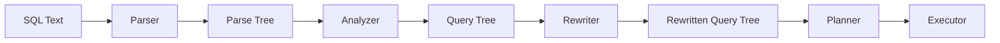
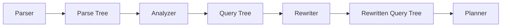

# Chapter 05 — Rewriter

## Introduction

After the PostgreSQL Analyzer completes semantic analysis, the SQL statement has been transformed into a fully validated **Query Tree**.

At this stage:

- SQL syntax has been validated.
- Database objects have been resolved.
- Functions and operators have been identified.
- Data types have been verified.
- User permissions have been checked.

However, PostgreSQL is still **not ready to generate an execution plan**.

Before the Planner begins optimization, PostgreSQL passes the Query Tree to another important component:

**The Rewriter.**

The Rewriter examines the Query Tree and determines whether it should be modified according to PostgreSQL's rewrite rules.

Typical rewrite operations include:

- Expanding views
- Applying rules
- Transforming queries
- Replacing virtual objects with their underlying queries

The output of the Rewriter is another Query Tree that represents the actual query to be optimized by the Planner.

---

## Learning Objectives

After completing this chapter, you will be able to:

- Explain the purpose of the PostgreSQL Rewriter.
- Understand why rewriting is necessary.
- Describe PostgreSQL's Rule System.
- Explain how views are expanded.
- Understand `INSTEAD` rules.
- Explain rewrite rules for `SELECT`, `INSERT`, `UPDATE`, and `DELETE`.
- Follow the transformation of a Query Tree through the rewrite stage.
- Understand how rewriting affects planning and execution.
- Identify situations where rewrite rules improve or complicate query processing.

---

## Position in the Query Processing Pipeline

The Rewriter sits between the Analyzer and the Planner.



The Parser focuses on **syntax**.

The Analyzer focuses on **semantics**.

The Rewriter focuses on **query transformation**.

The Planner focuses on **optimization**.

Each component has a distinct responsibility.

---

## Why the Rewriter Exists

Many SQL statements reference objects that do not directly store data.

Examples include:

- Views
- Rewrite rules
- Some system-generated transformations

Consider the following query:

```sql
SELECT *
FROM active_employees;
```

Suppose `active_employees` is a view.

The Planner cannot optimize a view directly because a view stores only a query definition, not actual data.

The Rewriter replaces the view with its underlying SQL query.

Only after this transformation can the Planner optimize the query.

---

## Summary

The Rewriter is responsible for transforming a validated Query Tree into another Query Tree that reflects PostgreSQL's rewrite rules. It expands views, applies rules, and prepares the query for optimization by the Planner.


---

# What is the Rewriter?

## Definition

The **Rewriter** is the PostgreSQL component that transforms a semantically valid **Query Tree** into another **Query Tree** by applying PostgreSQL's rewrite rules.

Unlike the Parser and Analyzer, the Rewriter does **not**:

- Check SQL syntax
- Resolve object names
- Validate data types
- Verify permissions

Those responsibilities have already been completed.

Instead, the Rewriter examines the Query Tree and determines whether any transformations are required before planning begins.

---

# Responsibilities of the Rewriter

The Rewriter is responsible for:

- Expanding views into their underlying queries
- Applying user-defined rewrite rules
- Applying system-generated rewrite rules
- Replacing virtual objects with their base queries
- Producing a rewritten Query Tree for the Planner

It never executes SQL.

It only transforms the structure of the query.

---

# Input and Output

### Input

```
Semantically Valid Query Tree
```

Generated by the Analyzer.

---

### Output

```
Rewritten Query Tree
```

Sent to the Planner.

---

Conceptually:

```text
Query Tree

↓

Apply Rewrite Rules

↓

Rewritten Query Tree
```

---

# Rewriter in the Query Pipeline



Notice that the Rewriter works entirely with **Query Trees**, not SQL text.

---

# Why Doesn't PostgreSQL Rewrite SQL Text?

Consider the query:

```sql
SELECT *
FROM active_employees;
```

If PostgreSQL manipulated SQL text directly, it would need to:

- Parse SQL again
- Handle formatting differences
- Preserve aliases
- Maintain correct syntax

Instead, PostgreSQL modifies the already validated Query Tree.

This is faster, safer, and less error-prone.

---

# Query Tree Transformation

Suppose the Query Tree contains:

```text
FROM

↓

active_employees (View)
```

After rewriting:

```text
FROM

↓

employees

↓

WHERE status = 'Active'
```

The Planner never needs to know that the user originally queried a view.

It receives only the rewritten tree.

---

# What the Rewriter Does NOT Do

The Rewriter does **not**:

❌ Execute SQL

❌ Read table data

❌ Estimate query costs

❌ Choose indexes

❌ Determine join order

❌ Optimize execution plans

Those tasks belong to the Planner and Executor.

---

# Rewriter vs Analyzer

| Analyzer | Rewriter |
|----------|----------|
| Validates semantics | Transforms queries |
| Resolves tables | Expands views |
| Resolves columns | Applies rules |
| Resolves functions | Produces rewritten Query Tree |
| Performs type checking | Does not validate types again |
| Checks permissions | Uses already validated metadata |

The Analyzer answers:

> "Is this query valid?"

The Rewriter answers:

> "Should this query be transformed before planning?"

---

# Simple Example

Suppose a view is defined as:

```sql
CREATE VIEW active_employees AS
SELECT *
FROM employees
WHERE status = 'Active';
```

User query:

```sql
SELECT *
FROM active_employees;
```

Conceptually, the Rewriter transforms it into:

```sql
SELECT *
FROM employees
WHERE status = 'Active';
```

The Planner optimizes the expanded query, not the original view reference.

---

# Business Example

A reporting application contains dozens of predefined views.

Users write simple SQL such as:

```sql
SELECT *
FROM monthly_sales;
```

The Rewriter replaces `monthly_sales` with its underlying query before planning begins.

This allows:

- Simpler application SQL
- Centralized business logic
- Consistent reporting
- Planner optimization on the actual query

---

# Benefits of the Rewriter

### 1. Supports Views

Views behave like tables even though they store only SQL definitions.

---

### 2. Enables Rule-Based Transformations

Rewrite rules can modify queries automatically before planning.

---

### 3. Simplifies Applications

Applications can query views without knowing their internal implementation.

---

### 4. Improves Maintainability

Business logic can be centralized inside views and rules instead of duplicated across applications.

---

# Common Misconceptions

❌ The Rewriter optimizes SQL.

✔ Optimization is performed later by the Planner.

---

❌ The Rewriter executes SQL.

✔ It only transforms the Query Tree.

---

❌ The Rewriter validates syntax.

✔ Syntax validation is the Parser's responsibility.

---

❌ Every query is heavily rewritten.

✔ Many simple queries pass through the Rewriter unchanged.

---

# Best Practices

- Use views to encapsulate reusable query logic.
- Keep rewrite rules simple and well documented.
- Avoid overly complex rule chains that make queries difficult to understand.
- Remember that rewriting changes the internal query representation, not the SQL text you wrote.

---

# Interview Questions

1. What is the PostgreSQL Rewriter?
2. Which component provides input to the Rewriter?
3. What is the output of the Rewriter?
4. Does the Rewriter operate on SQL text or Query Trees?
5. Does the Rewriter execute SQL?
6. Which component expands views?
7. What is the primary responsibility of the Rewriter?
8. Which component receives the rewritten Query Tree?

---

# Summary

The PostgreSQL Rewriter transforms a validated Query Tree into a rewritten Query Tree by applying view expansion and rewrite rules. It operates on PostgreSQL's internal query representation rather than SQL text, allowing efficient and reliable query transformation before optimization begins. The rewritten Query Tree is then passed to the Planner, which determines the most efficient execution strategy.


